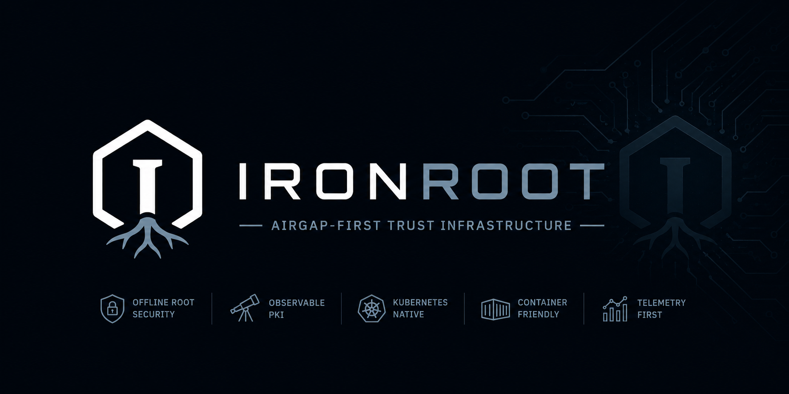

# IronRoot


> Airgap-first trust infrastructure



IronRoot is a modern internal PKI platform for air-gapped environments, offline-root security, observable certificate operations, Kubernetes-native deployments, and self-hosted infrastructure.

## Documentation maturity

IronRoot is currently Alpha-stage. Documentation pages use maturity badges so readers can quickly see how complete and validated a workflow is:

- **Stage** describes feature maturity, from Concept through Mature.
- **Status** describes documentation state, such as Draft, In Progress, Experimental, Stable, or Deprecated.
- **Validation badges** are only used when workflows have been tested in that environment.
- **Capability badges** identify implemented capabilities such as OpenTelemetry support or zero-trust-oriented workflows.

Most pages currently use `Stage: Alpha` and `Status: Draft`. The primary onboarding path is **Contributing > Local Development**, currently marked `Status: In Progress`. See `docs/contributing/documentation-standards.md` for the badge model.

## What the name means

**Iron** represents hardened infrastructure, durability, security, industrial-grade systems, and an airgap-first mindset.

**Root** represents the Root CA, trust anchor, certificate trust chain, and identity foundation.

Together: **IronRoot represents hardened trust infrastructure designed for modern self-hosted and air-gapped environments.**

## Architecture

```text
Offline Root CA
    |
    | signs Intermediate CA
    v
Online Go PKI Server
    |
    | REST API + OpenTelemetry
    v
Admin CLI + Client CLI
    |
    | enroll / request / renew
    v
Homelab servers and Kubernetes services
```

## Quick start

```bash
just install-local
ironroot-dev dev-init

bin/ironroot-admin ca create-root \
  --name "IronRoot Local Root CA" \
  --password ironroot-local-root \
  --out .localdev/pki/root

bin/ironroot-admin ca create-intermediate \
  --root-cert .localdev/pki/root/root-ca.crt \
  --root-key .localdev/pki/root/root-ca.key \
  --root-password ironroot-local-root \
  --password ironroot-local-intermediate \
  --out .localdev/pki/intermediate

bin/ironroot-admin --config .localdev/config/config.yaml init-server
bin/ironroot-server --config .localdev/config/config.yaml
```

```bash
bin/ironroot-admin --config .localdev/config/config.yaml create-token --host local-demo --ttl 24h
bin/ironroot-client enroll --server http://localhost:8443 --hostname local-demo --token <token>
bin/ironroot-client request-cert --server http://localhost:8443 --enrollment-id <id> --dns demo.home.arpa --out .localdev/certs/demo.home.arpa
```

For the browser-trusted website walkthrough, including `/etc/hosts`, nginx/Caddy/Python examples, and OS/browser trust-store installation, follow [docs/getting-started/local-quickstart.md](docs/getting-started/local-quickstart.md).

## Cross-platform Binaries

IronRoot supports Linux and macOS on amd64 and arm64:

```bash
just build-local
just build-linux
just build-macos
just build-all
just install-local
```

`just install-local` runs `just build-local` first, then copies the freshly built binaries into your local install prefix. It installs the production-facing binaries, `irtop` for operator monitoring, plus `ironroot-dev`, the contributor-only helper CLI used for local workspace setup:

```bash
irtop --help
ironroot-dev --help
ironroot-dev dev-init --help
```

`ironroot-dev` is not required in production. It keeps developer workflows versioned, testable, and easier to extend than shell-only task runner logic.

IronRoot binaries:

- `ironroot-server`: PKI API server
- `ironroot-admin`: administrator CLI
- `ironroot-client`: client enrollment and certificate CLI
- `ironroot-dev`: contributor-only helper CLI
- `irtop`: terminal UI for administrators to monitor IronRoot in real time

Release artifacts are packaged as:

- `ironroot-linux-amd64.tar.gz`
- `ironroot-linux-arm64.tar.gz`
- `ironroot-darwin-amd64.tar.gz`
- `ironroot-darwin-arm64.tar.gz`

## First-time security bootstrap

Before exposing IronRoot, run the bootstrap guide and security check:

```bash
ironroot-admin bootstrap --output-checklist ./ironroot-security-checklist.md
ironroot-admin security-check --output table
ironroot-admin security-check --output markdown --write-report security-report.md
ironroot-admin security-check --fail-on high
```

The bootstrap guide focuses on offline Root CA handling, encrypted Intermediate CA storage, API TLS, filesystem permissions, backups, audit logging, OpenTelemetry posture, and recovery readiness.

## OpenTelemetry

IronRoot is observability-first. The server, admin CLI, client CLI, REST API, enrollment lifecycle, certificate issuance, renewal, revocation, bootstrap, security-check, audit writes, and database operations emit telemetry.

- Traces use W3C Trace Context so CLI operations continue through server-side API, CA, DB, and audit spans.
- Metrics cover API latency, enrollment failures, certificate lifecycle activity, security-check results, bootstrap runs, database latency, and telemetry exporter health.
- JSON logs include `trace_id` and `span_id` when a span is active, without printing private keys, bootstrap token values, or sensitive CA material.
- OTLP gRPC, OTLP HTTP, and Prometheus `/metrics` are supported.

## Terminal Monitoring

`irtop` provides a read-only terminal dashboard for IronRoot administrators:

```bash
irtop --server http://localhost:8443
irtop --server http://localhost:8443 --output text
irtop --server https://ironroot.example.com:8443 --ca-file ./root-ca.crt
```

It shows server health, CA health, certificates, enrollments, tokens, security status, telemetry status, and recent audit events without exposing private keys or token secret values.

Local development uses HTTP when the server TLS config is empty. Production deployments should use HTTPS with a trusted CA bundle or system trust store. `irtop` never silently downgrades HTTPS to HTTP.

Local observability examples live in `examples/otel/` and Grafana starter dashboards live in `examples/grafana/`.

```bash
podman-compose -f examples/otel/podman-compose.yaml up -d
OTEL_EXPORTER_OTLP_ENDPOINT=localhost:4317 OTEL_SERVICE_NAME=ironroot bin/ironroot-server
```

IronRoot works with OpenTelemetry Collector, Prometheus, Tempo, Loki, and Grafana. See `docs/observability/` for trace, metric, log, dashboard, and alerting guidance.

## Kubernetes and Podman

Kubernetes manifests live in `deploy/kubernetes`. The Podman-compatible image build lives in `deploy/container/Containerfile`.

```bash
just container-build
kubectl apply -k deploy/kubernetes
```

Podman local demo assets live under `examples/podman`, `examples/nginx`, `examples/caddy`, and `examples/python-https`.

## Airgap Overview

IronRoot separates offline trust creation from online issuance:

- Generate and back up the Root CA on an offline machine.
- Move only an Intermediate CSR to the offline machine.
- Sign the Intermediate offline.
- Move the signed Intermediate and public trust bundle to the online IronRoot server.
- Mirror binaries, container images, Helm charts, and trust bundles through approved offline channels.

See `docs/airgap/` for offline signing, trust distribution, and artifact mirroring guidance.

## Install with Helm

IronRoot publishes its Helm chart as an OCI artifact under the project GitHub account.

Install an RC chart:

```bash
helm install ironroot oci://ghcr.io/parisnakitakejser/charts/ironroot \
  --version 0.1.0-rc.1 \
  --namespace ironroot \
  --create-namespace
```

Install a stable chart:

```bash
helm install ironroot oci://ghcr.io/parisnakitakejser/charts/ironroot \
  --version 0.1.0 \
  --namespace ironroot \
  --create-namespace
```

Air-gapped environments should mirror both `ghcr.io/parisnakitakejser/ironroot:<version>` and `oci://ghcr.io/parisnakitakejser/charts/ironroot`, or download the chart `.tgz` from the GitHub Release and move it through the approved offline package path.

## Documentation

Documentation is built with MkDocs Material:

```bash
just docs-install
just docs-serve
just docs-build
just docs-deploy-local
```

The public documentation website is published from the generated `site/` output to the `website` branch for GitHub Pages. Configure GitHub Pages to serve from branch `website` and folder `/`.

Website: `https://parisnakitakejser.github.io/ironroot/`

Contributors should edit source docs under `docs/`, preview with `just docs-serve`, and run `just docs-build` before opening a pull request. Do not edit the generated `website` branch by hand.

## Project links

- Documentation: `docs/`
- Roadmap: `ROADMAP.md`
- Contributing: `CONTRIBUTING.md`
- Security disclosure: `SECURITY.md`
- License: `LICENSE`

## License

IronRoot is licensed under the Apache License 2.0.
