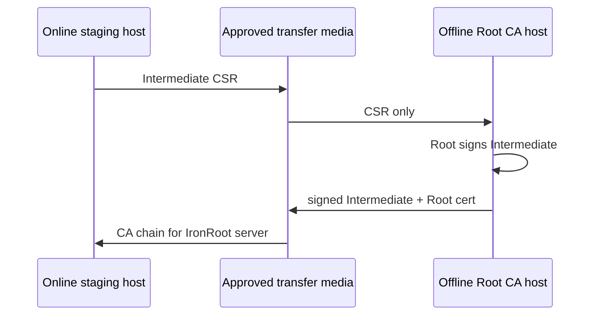

# Offline Signing

Offline signing keeps the Root CA private key away from the online IronRoot server.

Workflow:

1. Generate the Root CA on the offline machine.
2. Generate an Intermediate CA CSR.
3. Move only the CSR to the offline machine.
4. Sign the Intermediate with the Root CA.
5. Move the signed Intermediate certificate and chain back to the IronRoot server.

