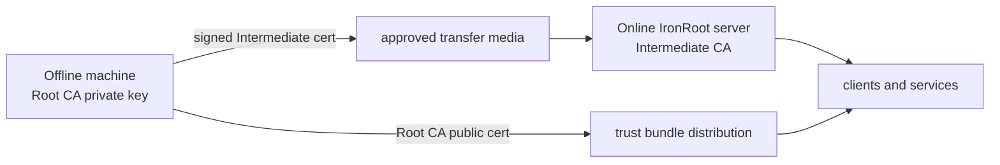

# Airgap Overview

An air-gapped environment has no direct Internet access. Software, trust bundles, container images, Helm charts, and binaries move through controlled distribution paths.

IronRoot's model separates offline trust creation from online certificate operations:

The online server never needs the Root CA private key.
