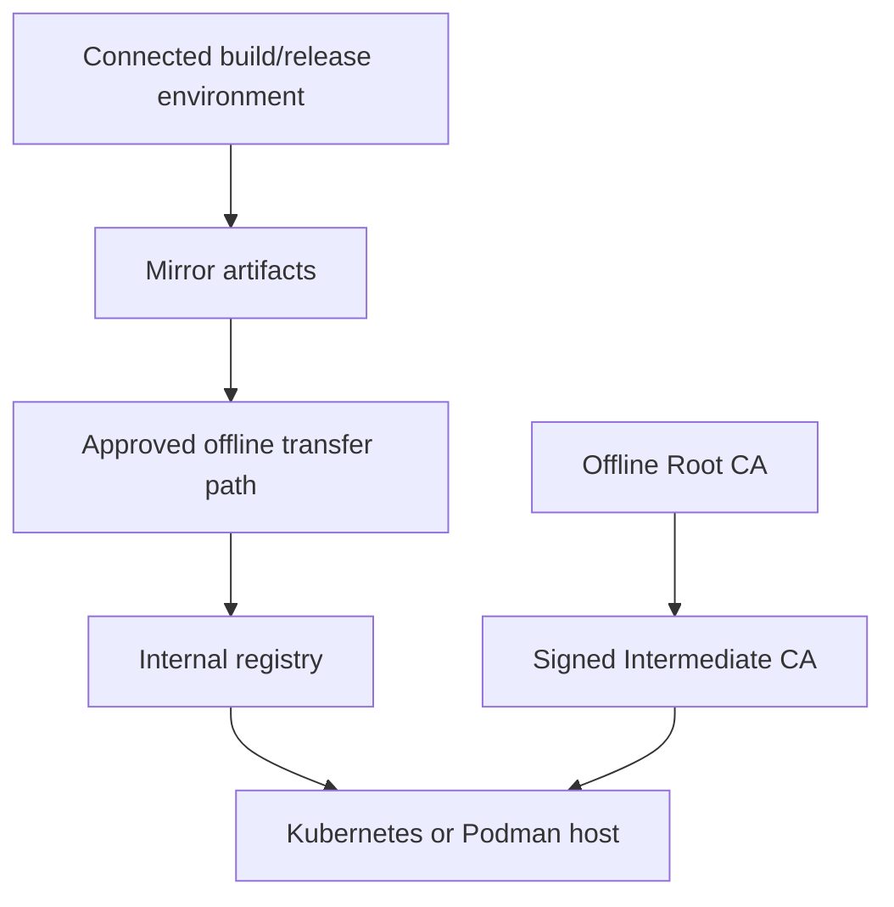
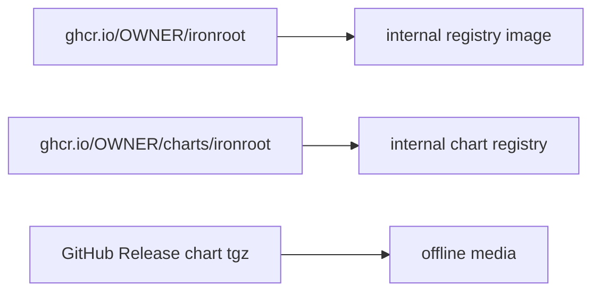
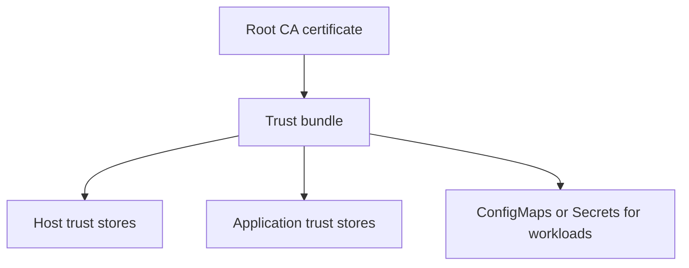

# Airgap-First Architecture

Airgap-first means IronRoot can be installed, operated, observed, and recovered without assuming live Internet access from the target environment.

## Deployment Flow

## Artifact Mirroring

Mirror:

- container image
- Helm chart OCI artifact or `.tgz`
- documentation package if needed
- public trust bundles

Do not mirror private Root CA keys as part of application artifacts.

## Offline Trust Distribution

Distribute public trust bundles through controlled configuration management. Rotate trust bundles before issuing from a new Root during migration.

