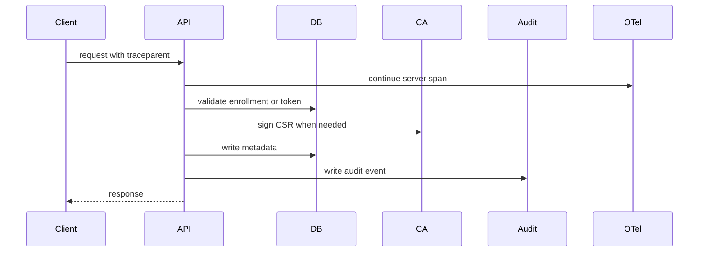
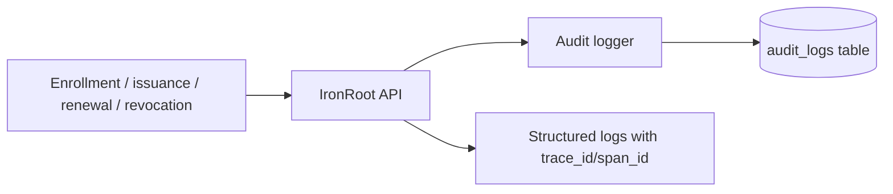

# IronRoot API Server

Status: In progress

The API server is the online control plane for enrollment, certificate issuance, renewal, revocation metadata, audit logging, and OpenTelemetry instrumentation.

## Responsibilities

- Expose REST endpoints for health, readiness, CA chain, enrollment, certificate lifecycle, and audit reads.
- Validate bootstrap token, hostname, and machine ID during enrollment.
- Accept CSRs from clients and sign them with the Intermediate CA.
- Store certificate metadata, enrollment records, revocation records, audit logs, bootstrap token hashes, and CA generation metadata.
- Emit traces, metrics, and structured logs.

## Request Lifecycle

## Deployment Types

| Type | Where it runs | Security implications |
| --- | --- | --- |
| Binary | Dedicated host or VM | Strong host filesystem control; you own systemd and backups |
| Podman | Rootless container on host | Immutable image with mounted `/config`, `/data`, `/pki` |
| Kubernetes | Deployment with Secret, ConfigMap, PVC | Requires tight Secret RBAC, securityContext, NetworkPolicy, and internal Service design |

## Audit Flow

Audit logging is not optional behavior in the current server write path. Retention controls are future work, so operators should back up and rotate database storage according to local policy.

