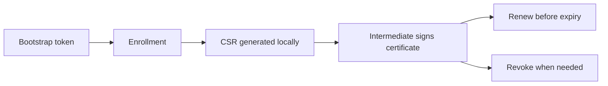

# Certificate Lifecycle

Certificates move through enrollment, issuance, renewal, status checks, and revocation.

```mermaid
flowchart LR
  Token[Bootstrap token] --> Enroll[Enrollment]
  Enroll --> CSR[CSR generated locally]
  CSR --> Issue[Intermediate signs certificate]
  Issue --> Renew[Renew before expiry]
  Issue --> Revoke[Revoke when needed]
```

IronRoot defaults to short-lived server certificates and renewal before expiry.
