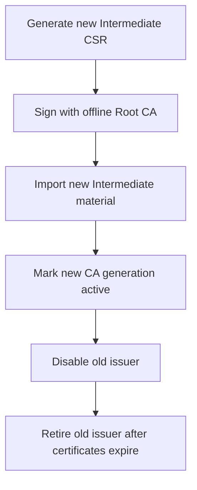
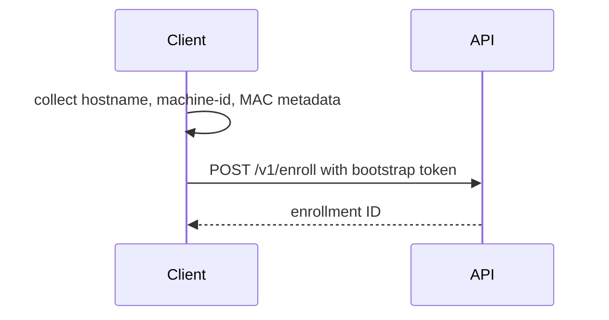
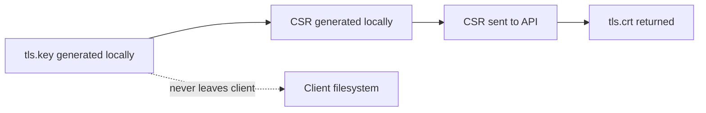

# CLI Architecture

<div class="ironroot-doc-meta" markdown>
<span class="ironroot-badge ironroot-badge--stage">Stage: Alpha</span>
<span class="ironroot-badge ironroot-badge--status">Status: Draft</span>
</div>

IronRoot has two operational CLIs with different trust levels.

## Admin CLI

The Admin CLI is for trusted operators. It can initialize storage, create bootstrap tokens, run first-run bootstrap guidance, run security checks, revoke certificates, and later manage CA generation migration.

Recommended location:

- secure operator workstation
- dedicated admin host
- controlled CI job with no production private keys

Do not expose the Admin CLI to untrusted users or shared automation contexts.

### Bootstrap Workflow

```bash
ironroot-admin bootstrap --output-checklist ./ironroot-security-checklist.md
ironroot-admin security-check --config /config/config.yaml --output table
```

### Token Creation Workflow

```bash
ironroot-admin create-token --host node-01 --ttl 1h
```

Bootstrap tokens are stored hashed in the database. Raw token values should only be shown once and should not be logged.

### Intermediate Rotation Workflow



The current MVP documents this flow and stores CA generation metadata. Full mutation APIs are future work.

## Client CLI

The Client CLI runs on workload hosts or automation runners. It generates private keys locally, generates CSRs locally, sends only CSRs to IronRoot, installs trust bundles, and renews certificates.

### Enrollment Flow



### CSR Generation Flow



### Trust Installation Lifecycle

The client can fetch the Root CA bundle and write it to a local trust output directory. Operators should decide how that bundle is installed into OS or application trust stores.
