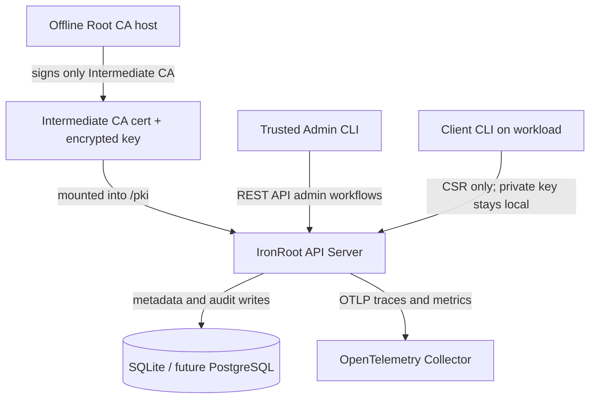
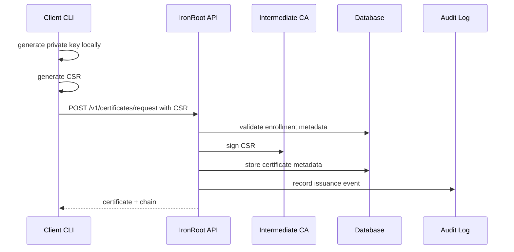

# Component Architecture

IronRoot is intentionally split into components with different trust levels. The split exists to keep the long-lived Root CA offline while still allowing automated certificate issuance for servers, clients, and Kubernetes workloads.

## Component Responsibilities

| Component | What it does | Where it should run | Trust boundary |
| --- | --- | --- | --- |
| Offline Root CA | Signs Intermediate CA certificates only | Offline or air-gapped machine | Highest trust, not online |
| Online Intermediate CA | Signs workload CSRs through IronRoot | IronRoot server host or pod | Online issuing trust |
| IronRoot API server | Enrollment, CSR signing, certificate status, revocation metadata, audit logs, telemetry | Binary host, Podman container, or Kubernetes Deployment | Online application boundary |
| Admin CLI | Bootstrap, token creation, security checks, future CA migration operations | Trusted operator workstation or secure admin host | Operator boundary |
| Client CLI | Trust install, enroll, generate local key/CSR, request/renew certificates | Workload host or automation runner | Workload identity boundary |
| OpenTelemetry stack | Receives traces, metrics, and logs | Internal observability platform | Operational visibility boundary |

## Recommended Deployment Model

The Root CA private key should not run continuously, should not be copied to the IronRoot server, and should never exist in Kubernetes, containers, images, ConfigMaps, Secrets, CI logs, or support bundles.

## What Must Never Be Done

- Do not copy the Root CA private key to the IronRoot server.
- Do not place the Root CA private key in Kubernetes.
- Do not bake CA private keys into container images.
- Do not sign normal server certificates directly with the Root CA.
- Do not send client private keys to the API server.
- Do not store raw bootstrap tokens in logs, reports, traces, or issue tickets.
- Do not expose the API publicly without TLS and planned authentication controls.

## How Components Communicate

The API receives CSRs, not private keys. The Intermediate CA signs certificates online because automation requires it. The Root CA stays offline to limit the blast radius if the online server is compromised.

