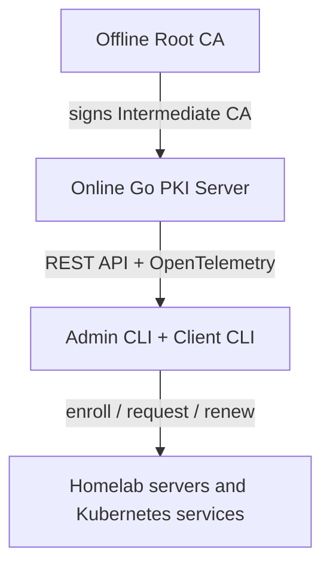

# Architecture Overview

IronRoot separates long-lived trust anchors from day-to-day certificate issuance.

## Core model

1. Root CA creation happens offline and outside normal server runtime.
2. The server holds only the Intermediate CA private key and certificate.
3. Clients generate private keys locally and submit CSRs.
4. The server signs CSRs and stores certificate metadata, enrollment records, revocation records, audit logs, bootstrap tokens, and CA generation metadata.
5. OpenTelemetry trace context flows from client commands to API handlers and storage operations.

## Storage boundary

The storage layer is interface-based. SQLite is the default backend for the MVP, while PostgreSQL can be added behind the same repository contract.

## CA generations

The schema supports multiple CA generations using `ca_id`, fingerprints, status, and validity windows. This prepares IronRoot for root migration without forcing existing certificates to rotate immediately.

## Learn the Architecture

Read these pages before deploying IronRoot in production:

- [Component Architecture](components.md)
- [Offline Root CA](offline-root-ca.md)
- [Online Intermediate CA](online-intermediate-ca.md)
- [IronRoot API Server](api-server.md)
- [CLI Architecture](cli.md)
- [OpenTelemetry Architecture](telemetry.md)
- [Security Boundaries](trust-boundaries.md)
- [Airgap-First Architecture](airgap.md)
