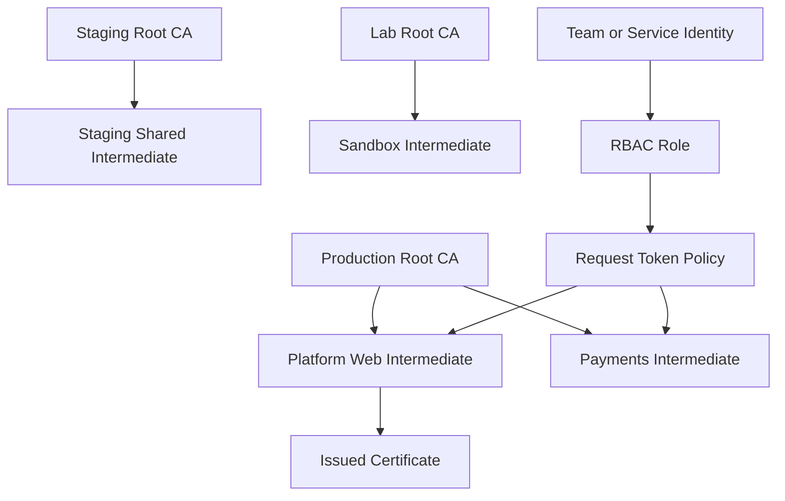

# Multi-Root CA Architecture

IronRoot supports a metadata model for multiple Root CAs and multiple Intermediate CAs per Root. The model is designed for production, staging, development, testing, and lab environments without assuming a single global trust anchor.

## Domain Model

| Entity | Purpose |
| --- | --- |
| Root CA | Offline trust anchor scoped to an environment or trust domain. |
| Intermediate CA | Online issuer scoped to a team, service, tenant, namespace, or environment. |
| Certificate request | CSR plus requested usages/SANs, authorized against an Intermediate CA policy. |
| Issued certificate | Leaf certificate metadata tied to the Intermediate CA that signed it. |
| Revoked certificate | Revocation record and audit event for an issued certificate. |
| CA role | RBAC subject and permissions bound to an Intermediate CA. |
| Token policy | Request-scoped policy defining allowed issuer, certificate type, SANs, TTL, issuance limit, renewal, and approval rules. |

## Security Model

Root CA private keys remain offline. Intermediate CAs are the online signing boundary and must be independently revocable, disabled, or retired.

Users and clients do not gain signing permission by enrolling. They authenticate to IronRoot and request a temporary/request-scoped token. That token is evaluated against:

- the target Intermediate CA
- certificate type and requested usages
- allowed DNS/SAN patterns
- maximum certificate lifetime
- issuance count limit
- renewal permission
- approval requirements

The least-privilege rule is that every certificate request must name or resolve to one Intermediate CA, and authorization must be checked against that issuer before signing.

## Current Implementation Boundary

The database and status API now model:

- multiple Root CAs
- multiple Intermediate CAs per Root
- RBAC role bindings
- token/request policies
- certificate counts per Intermediate CA
- active, disabled, retired, pending, and testing issuer states

The existing live signing path remains backward compatible with the current single active `ca.Authority`. Future mutation APIs should use the same metadata model when adding issuer import, issuer selection, approval workflow, and request-scoped signing tokens.

## Operational Guidance

- Use separate Root CAs for materially different trust domains such as production, staging, lab, and testing.
- Use separate Intermediate CAs for teams, tenants, namespaces, or services with different risk or policy requirements.
- Prefer short-lived token policies over broadly reusable issuer permissions.
- Require approval for high-risk namespaces, wildcard DNS, production payments/security services, and long TTLs.
- Disable an Intermediate CA immediately after suspected compromise; keep the Root CA offline for controlled replacement.

See `examples/ca-hierarchy.yaml` for a complete YAML structure.
