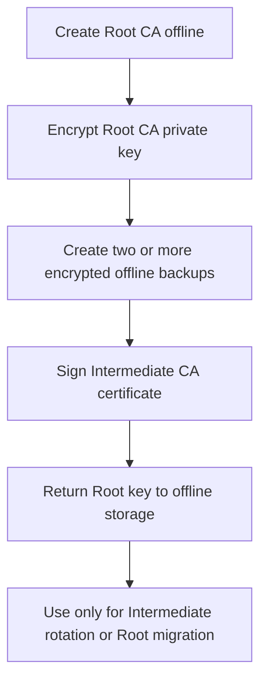
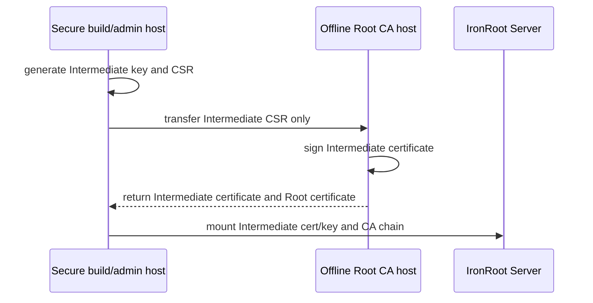
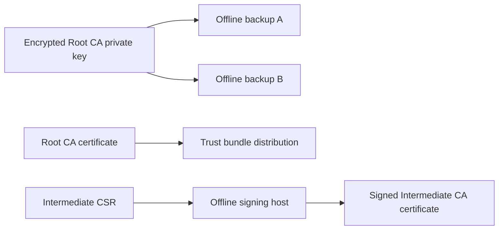
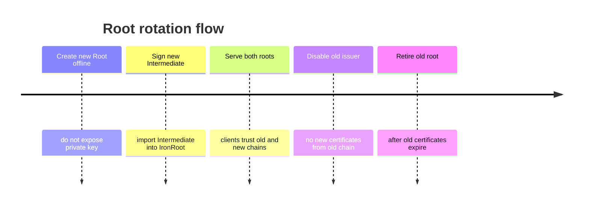

# Offline Root CA

Stage: Alpha
Status: Draft

The Root CA is the trust anchor. It should not be an always-on service. It should ideally live on an offline or air-gapped machine and only be powered on or mounted when signing a new Intermediate CA or performing a planned root migration.

## Responsibilities

- Create the top-level trust anchor.
- Sign Intermediate CA certificates.
- Support planned Root CA migration.
- Stay offline and protected from routine operational access.

## Lifecycle

Recommended Root CA lifetime: 20 years.

## Signing Workflow

The Root CA private key does not leave the offline machine. The object transferred to the online environment is the Intermediate certificate, not the Root key.

## Offline Storage Architecture

Root CA backups should be encrypted, offline, and stored in separate physical or administrative locations.

## Recovery Guidance

Recovery should be tested before production. A recovery runbook should cover:

- where encrypted Root CA backups are stored
- who can access decryption material
- how to verify backup integrity
- how to sign a replacement Intermediate CA
- how to publish a new trust bundle without exposing Root private key material

## Migration Guidance

IronRoot's CA generation schema is designed for this phased model. Existing certificates can continue until expiry while new certificates are issued from the new Intermediate.
