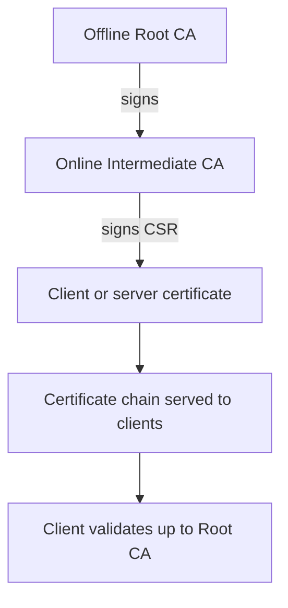
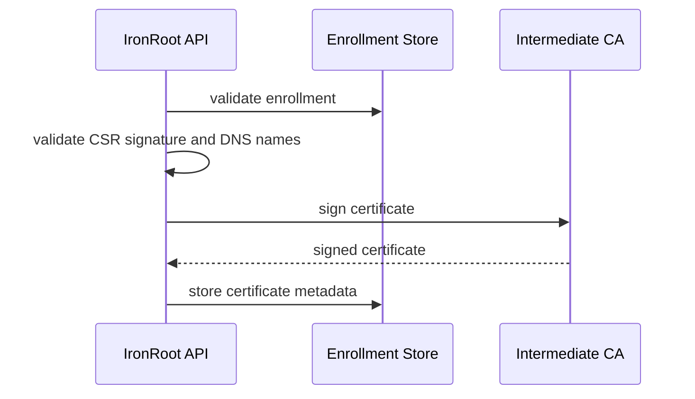
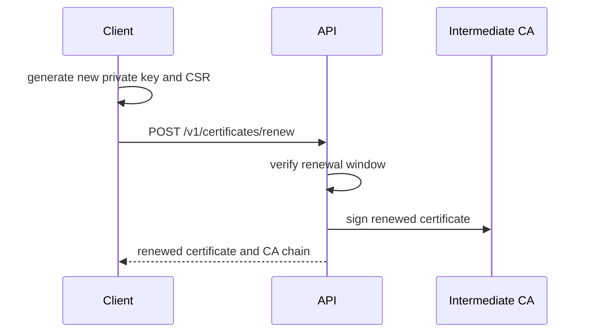

# Online Intermediate CA

Status: In progress

The Intermediate CA is the operational issuing CA. It lives with the IronRoot server because certificate automation needs an online signer, but it is deliberately separated from the Root CA.

## Why It Exists

The Intermediate CA protects the Root CA by absorbing operational risk. If the online environment is compromised, operators can revoke or retire the Intermediate and keep the Root CA offline for a controlled replacement.

## Responsibilities

- Sign client and server CSRs.
- Provide a chain from issued certificate to Root CA.
- Rotate on a shorter lifecycle than the Root CA.
- Stay encrypted at rest and restricted by filesystem or Kubernetes Secret access.

Recommended Intermediate CA lifetime: 5 years.

## Certificate Chain

Certificate chains matter because clients usually trust the Root CA, while the workload certificate is signed by the Intermediate. The chain proves that the Intermediate is authorized by the Root.

## Intermediate Signing Flow

## Renewal Flow

## Operational Requirements

- Store the Intermediate private key encrypted at rest where possible.
- Use owner-only filesystem permissions on binary/Podman hosts.
- Use Kubernetes Secrets with narrowly scoped access in Kubernetes.
- Back up the Intermediate key, certificate, chain, and database together.
- Never bake the Intermediate private key into a container image.

