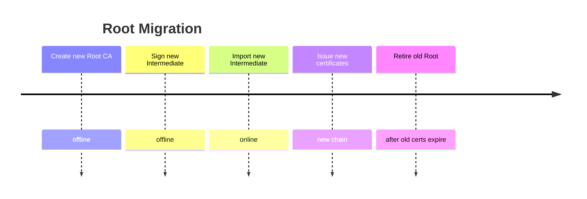

# Root Rotation

Stage: Alpha
Status: Draft

Root rotation introduces a new offline Root CA and a new Intermediate CA while old certificates continue until expiry.

```mermaid
timeline
  title Root Migration
  Create new Root CA : offline
  Sign new Intermediate : offline
  Import new Intermediate : online
  Issue new certificates : new chain
  Retire old Root : after old certs expire
```
