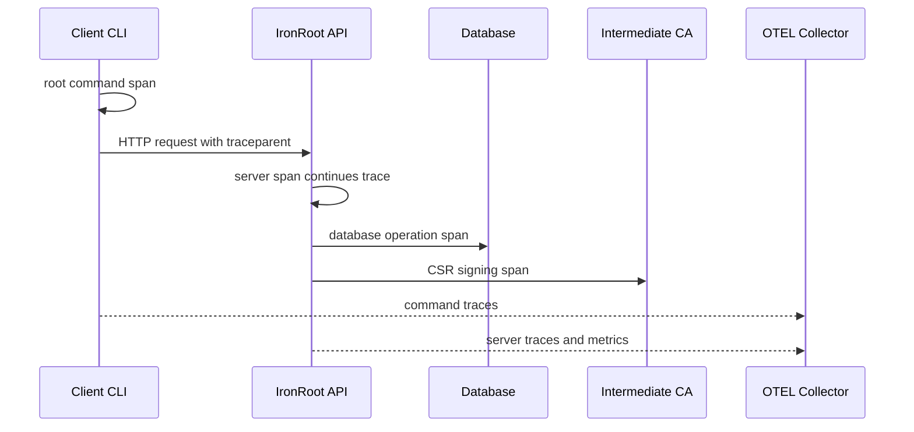
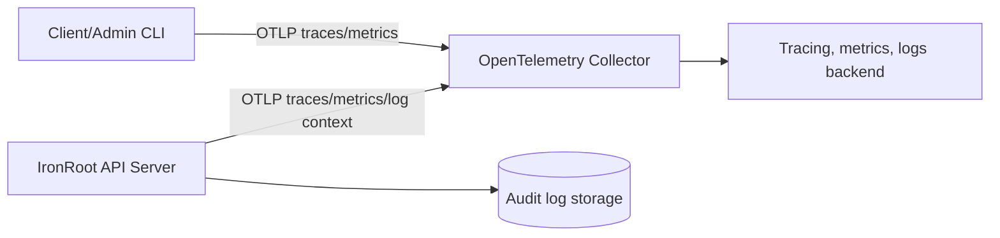
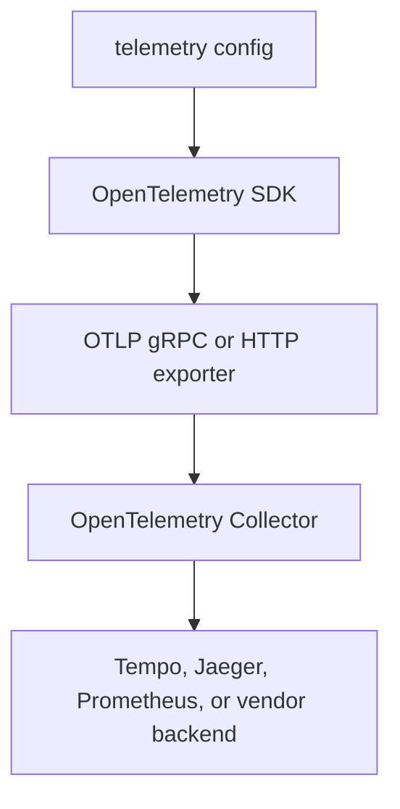

# OpenTelemetry Architecture

Stage: Alpha
Status: Draft

Observability matters in PKI because certificate operations are security-sensitive operational events. Operators need to answer who enrolled, who requested a certificate, what issuer signed it, whether renewals are succeeding, and whether failures are clustered around a service or environment.

## Trace Propagation

## Telemetry Architecture

The audit log is the durable security record. Telemetry is operational visibility and should not contain private keys, raw bootstrap tokens, or secret values.

## OTLP Export Flow

Client commands create root spans. Server requests continue traces through W3C Trace Context. Security-check emits per-category spans and result metrics by severity and status.
