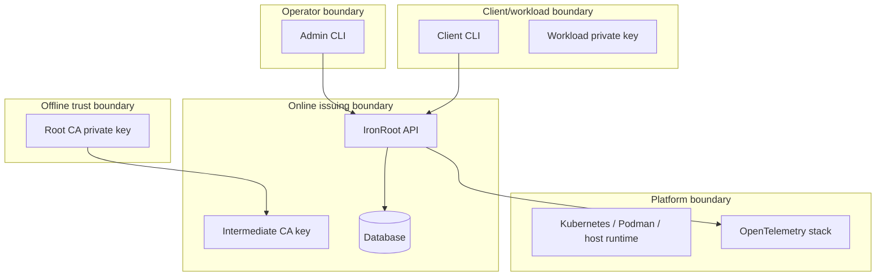
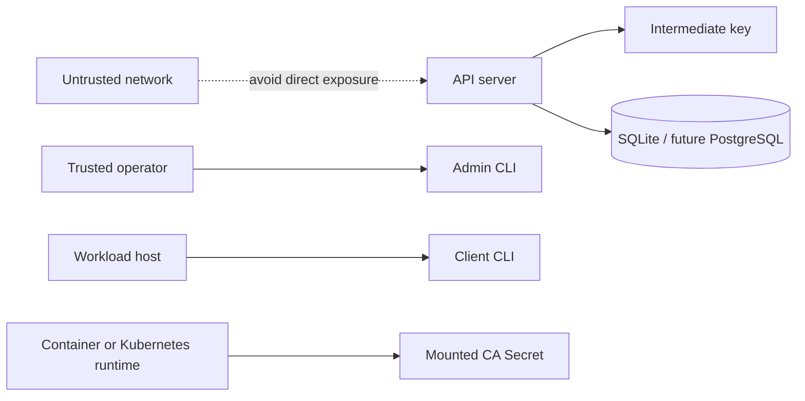

# Security Boundaries

Stage: Alpha
Status: Draft

IronRoot is designed around explicit trust boundaries. Each boundary limits what an attacker can reach if one layer is compromised.

## Attack Surface Overview

Primary controls:

- keep Root CA offline
- keep Intermediate CA permissions strict
- enable TLS before remote API exposure
- scope Kubernetes Secret access tightly
- use NetworkPolicy where possible
- audit important actions
- monitor with OpenTelemetry without leaking secrets

## Secure Deployment Model

The secure model is not just "install the server." It is:

1. Generate and store Root CA offline.
2. Sign an Intermediate CA with the Root CA.
3. Mount only Intermediate CA material and public Root/chain files into IronRoot.
4. Run the API with TLS and restricted filesystem permissions.
5. Use short-lived bootstrap tokens.
6. Let clients generate private keys locally and send CSRs only.
7. Back up the database and Intermediate CA material together.
8. Keep Root CA recovery material offline and encrypted.
