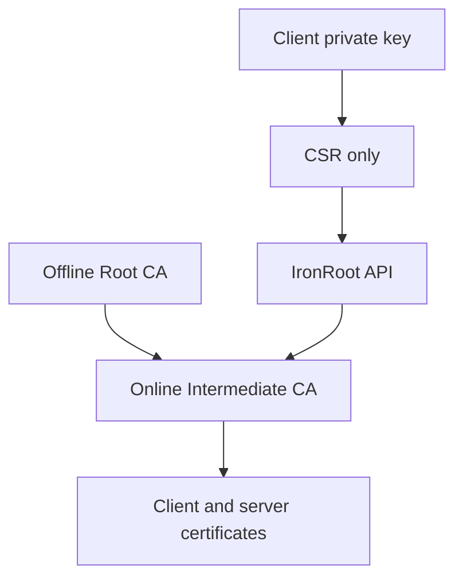

# Trust Model

Status: In progress

IronRoot trust starts at the offline Root CA. The Root CA signs Intermediate CAs only. The online IronRoot server holds the encrypted Intermediate CA key and uses it to sign workload certificates from validated CSRs.

The Root CA private key should never exist on the IronRoot server, in Kubernetes, inside containers, or in CI.
