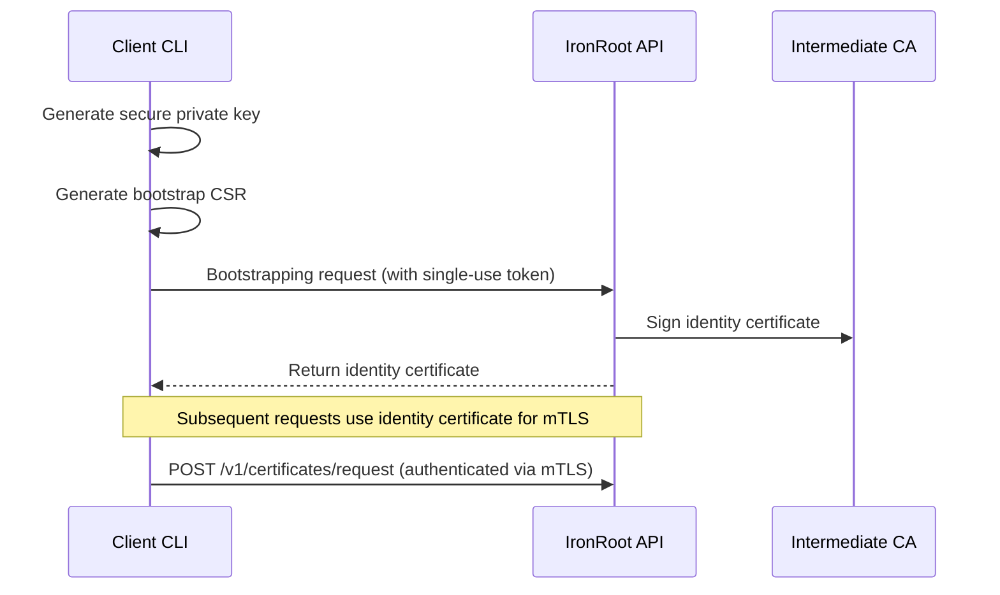
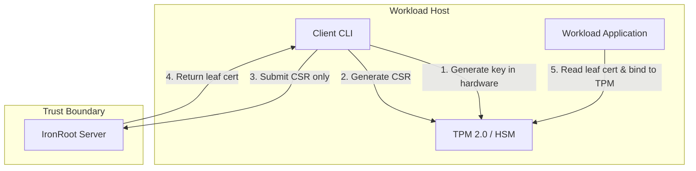
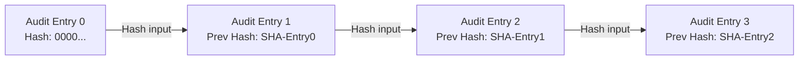

# Zero-Trust & Air-Gap Security Architecture

<div class="ironroot-doc-meta" markdown>
<span class="ironroot-badge ironroot-badge--stage">Stage: Alpha</span>
<span class="ironroot-badge ironroot-badge--status">Status: Experimental</span>
</div>

This document outlines the architectural blueprints for running IronRoot under strict zero-trust networks and disconnected, air-gapped environments.

---

## 1. Zero-Trust Machine Identity & mTLS

Zero-trust network architectures assume that any network is compromised. IronRoot implements Mutual TLS (mTLS) to secure all communications between clients, administrators, and the API server.



### Identity Bootstrapping Flow
1. **One-Time Enrollment Tokens:** Administrators generate cryptographically bound, single-use enrollment tokens with a maximum lifespan of 15 minutes.
2. **Ephemeral Identity Issuance:** The client CLI uses this token to request an identity certificate. The server signs the identity CSR, creating a short-lived machine certificate.
3. **Hardened mTLS Connection:** All subsequent API requests—including workload certificate issuance, renewals, and monitoring—require presenting this client identity certificate.

---

## 2. Hardware-Backed Private Keys (TPM 2.0 & PKCS#11)

Workload private keys must be protected against local filesystem exfiltration. IronRoot provides hardware-locking capabilities for high-trust workloads.



### Hardware Isolation Standards
* **TPM 2.0 Integration:** The client CLI leverages TPM 2.0 APIs on Linux nodes to generate and store keys directly inside the hardware module. Private keys never touch host RAM or standard filesystems.
* **PKCS#11/HSM Support:** Operator workstations use PKCS#11 interfaces to anchor signing keys in hardware tokens (such as YubiKeys or cloud HSMs), ensuring administrative credentials cannot be duplicated.

---

## 3. Cryptographically Chained Immutable Audit Log

To prevent local privilege escalation from tempering administrative histories, the audit log uses a cryptographic ledger chain.



* **Tamper-Evident Hashing:** Every audit log entry contains a SHA-256 fingerprint computed from the content of the current record concatenated with the hash of the preceding entry.
* **Continuous Integrity Verification:** The security check suite (`ironroot-admin security-check`) continuously parses the audit trail to recalculate and verify the ledger chain, instantly flagging any insertions, deletions, or history modifications.

---

## 4. Air-Gap Distribution Bundle & Verification

Ingesting artifacts across air-gaps requires verifying source integrity and bundling dependencies into a single offline package.

### Off-Grid Bundling Workflow
The offline bundler combines all required system components into a single tarball to facilitate offline ingestion:

```bash
# Generate the complete offline ingestion package
just airgap-package
```

The resulting package contains:
1. Compiled CLI and server binaries for all target architectures.
2. The complete Helm chart OCI directory.
3. Local container images packaged in Podman/Docker archive formats.
4. Static offline documentation site resources.

### Signature Verification
Every released air-gap package, binary, and container image is signed during the CI phase using Cosign and Sigstore. Ingestion gateways must verify the signatures using the public key before importing files into disconnected production clusters:

```bash
# Verify the authenticity of the container archive
cosign verify-image --key cosign.pub ghcr.io/parisnakitakejser/ironroot:v1.0.0
```
