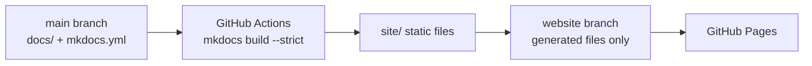

# Documentation Development

<div class="ironroot-doc-meta" markdown>
<span class="ironroot-badge ironroot-badge--stage">Stage: Alpha</span>
<span class="ironroot-badge ironroot-badge--status">Status: Draft</span>
</div>

IronRoot publishes the MkDocs Material site from the generated `site/` directory to a dedicated Git branch named `website`.

## Local Preview

Install documentation dependencies:

```bash
just docs-install
```

Start a live preview:

```bash
just docs-serve
```

Build the production site locally:

```bash
just docs-build
```

Generate the same local production output used by the website workflow:

```bash
just docs-deploy-local
```

The generated static site is written to `site/`.

Avoid running a globally installed `mkdocs` unless you have installed the project documentation dependencies into that same Python environment:

```bash
python -m pip install -r docs/requirements.txt
```

The project `justfile` is preferred because it uses `.venv-docs` and avoids missing-extension errors such as `No module named 'pymdownx'`.

## GitHub Pages Publishing

GitHub Pages should be configured to serve from:

- Branch: `website`
- Folder: `/`

Do not configure Pages to serve from `main` or `/docs`. The `docs/` directory contains MkDocs source files, not a Jekyll site. If GitHub Pages points at `/docs`, GitHub will run its Jekyll builder and fail on MkDocs Material assets.

The source documentation stays on `main` under `docs/`. The workflow builds the site from `main`, validates it with `mkdocs build --strict`, and publishes only generated static files to the `website` branch.

The `website` branch is an output branch only. Repository workflows are scoped to `main`, pull requests targeting `main`, or release tags, and the website publish commit includes `[skip ci]` as an additional guard. Do not open pull requests from `website` or edit it manually.

The publish workflow writes `.nojekyll` into the generated site before pushing it to `website`, so GitHub Pages serves the static MkDocs output directly.



## Contributor Rules

- Edit source files in `docs/`, `mkdocs.yml`, examples, or deployment docs.
- Preview locally with `just docs-serve`.
- Run `just docs-build` before opening a pull request.
- Do not commit generated `site/` output.
- Do not edit the `website` branch by hand.

The workflow publishes only successful builds, so broken navigation, missing referenced files, invalid MkDocs configuration, and strict-mode documentation errors block deployment.
