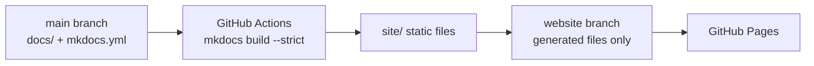

# Documentation Development

IronRoot publishes the MkDocs Material site from the generated `site/` directory to a dedicated Git branch named `website`.

## Local Preview

Install documentation dependencies:

```bash
make docs-install
```

Start a live preview:

```bash
make docs-serve
```

Build the production site locally:

```bash
make docs-build
```

Generate the same local production output used by the website workflow:

```bash
make docs-deploy-local
```

The generated static site is written to `site/`.

## GitHub Pages Publishing

GitHub Pages should be configured to serve from:

- Branch: `website`
- Folder: `/`

The source documentation stays on `main` under `docs/`. The workflow builds the site from `main`, validates it with `mkdocs build --strict`, and publishes only generated static files to the `website` branch.



## Contributor Rules

- Edit source files in `docs/`, `mkdocs.yml`, examples, or deployment docs.
- Preview locally with `make docs-serve`.
- Run `make docs-build` before opening a pull request.
- Do not commit generated `site/` output.
- Do not edit the `website` branch by hand.

The workflow publishes only successful builds, so broken navigation, missing referenced files, invalid MkDocs configuration, and strict-mode documentation errors block deployment.
