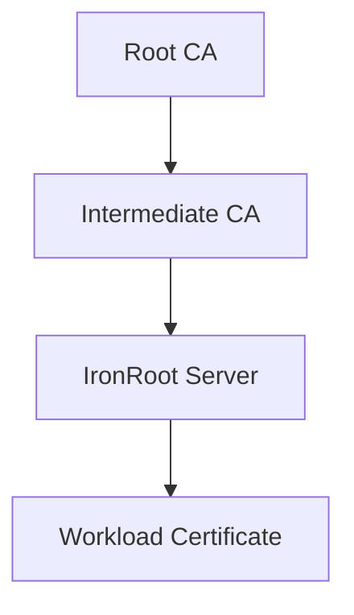
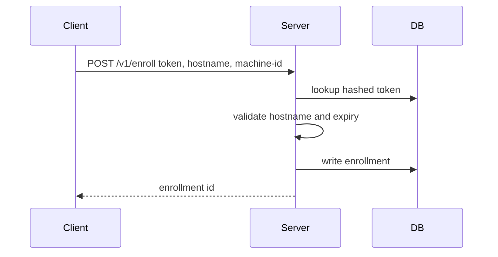
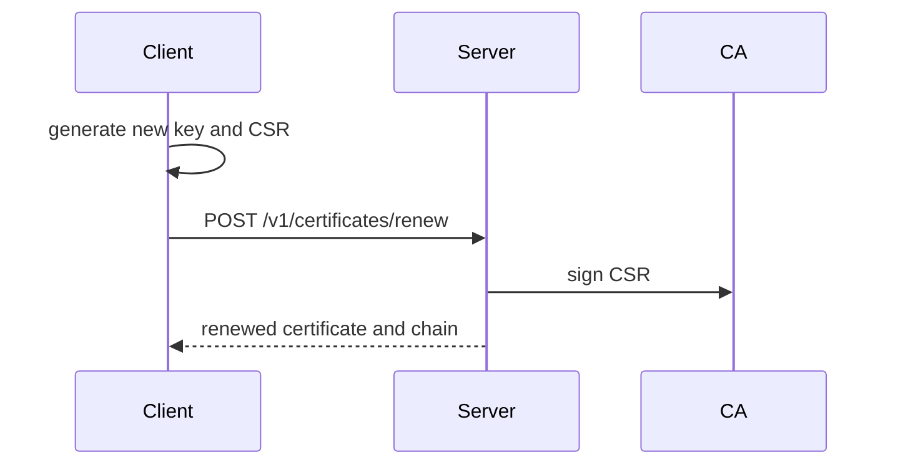
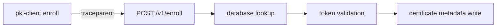
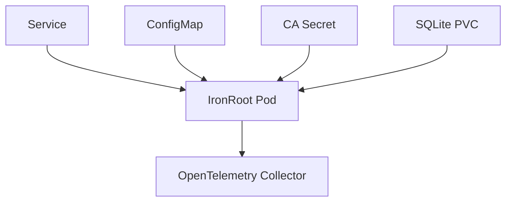

# Diagrams

## Trust chain

```mermaid
flowchart TD
  Root[Root CA] --> Intermediate[Intermediate CA]
  Intermediate --> Server[IronRoot Server]
  Server --> Cert[Workload Certificate]
```

## Enrollment flow

```mermaid
sequenceDiagram
  participant Client
  participant Server
  participant DB
  Client->>Server: POST /v1/enroll token, hostname, machine-id
  Server->>DB: lookup hashed token
  Server->>Server: validate hostname and expiry
  Server->>DB: write enrollment
  Server-->>Client: enrollment id
```

## Renewal flow

```mermaid
sequenceDiagram
  participant Client
  participant Server
  participant CA
  Client->>Client: generate new key and CSR
  Client->>Server: POST /v1/certificates/renew
  Server->>CA: sign CSR
  Server-->>Client: renewed certificate and chain
```

## OpenTelemetry trace flow

```mermaid
flowchart LR
  CLI[pki-client enroll] -->|traceparent| API[POST /v1/enroll]
  API --> DB[database lookup]
  DB --> Token[token validation]
  Token --> Write[certificate metadata write]
```

## Kubernetes deployment

```mermaid
flowchart TD
  Service[Service] --> Pod[IronRoot Pod]
  ConfigMap[ConfigMap] --> Pod
  Secret[CA Secret] --> Pod
  PVC[SQLite PVC] --> Pod
  Pod --> Collector[OpenTelemetry Collector]
```

