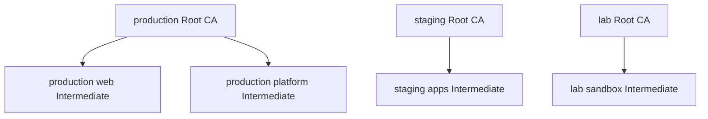

# 9. Advanced Architecture

<div class="ironroot-doc-meta" markdown>
<span class="ironroot-badge ironroot-badge--stage">Stage: Alpha</span>
<span class="ironroot-badge ironroot-badge--status ironroot-badge--in-progress">Status: In Progress</span>
</div>

Use this page when planning multiple environments, tenants, teams, or CA hierarchies.

## Prerequisites

- Understand [Production Deployment](production.md).
- Understand Root CA and Intermediate CA separation.

## Multi-Root Model



Use multiple Root CAs when environments need independent trust anchors, lifecycle policies, or blast-radius boundaries.

## Intermediate CA Scoping

Intermediate CAs can represent:

- teams.
- services.
- tenants.
- environments.
- certificate classes.
- operational ownership boundaries.

Pair each Intermediate CA with explicit RBAC and token policies.

## Example Hierarchy Manifest

```yaml
apiVersion: ironroot.io/v1alpha1
kind: RootCA
metadata:
  name: production-root
spec:
  environment: production
  owner: security
---
apiVersion: ironroot.io/v1alpha1
kind: IntermediateCA
metadata:
  name: production-platform
spec:
  rootRef: production-root
  environment: production
  namespace: platform
  owner: platform-security
  maxTTL: 2160h
```

See `examples/ca-hierarchy.yaml` for a larger example.

## Integration Points

Plan for:

- API integrations for automation.
- GitOps deployment of RBAC.
- external secret managers.
- observability pipelines.
- backup/restore automation.
- future HA and distributed backends.

## Expected Outcome

You can model production, staging, development, testing, and lab trust hierarchies without assuming a single Root CA.

## Validation

```bash
curl -s http://localhost:8443/v1/status/ca-hierarchy | jq '.roots[] | {name, environment, intermediates}'
```

In `irtop`, press `5` and confirm the hierarchy is readable.

## Troubleshooting

| Symptom | Check |
| --- | --- |
| Single-root assumptions appear in code or docs | Prefer Root/Intermediate IDs and environment metadata over global singleton names. |
| Tenant boundaries unclear | Assign each tenant/team to explicit Intermediate CAs and RBAC bindings. |
| CA sprawl | Define naming, ownership, expiration, and rotation rules before adding more CAs. |

## Next Step

Continue to [Troubleshooting](troubleshooting.md), then use the architecture pages for deeper design work.
