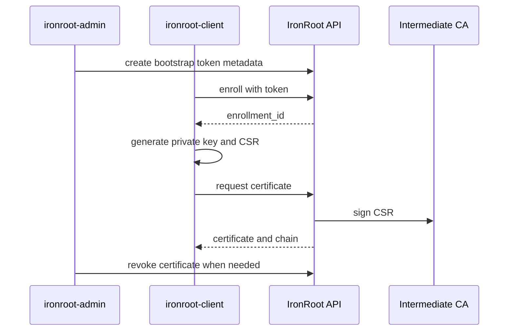

# 5. Certificate Workflows

<div class="ironroot-doc-meta" markdown>
<span class="ironroot-badge ironroot-badge--stage">Stage: Alpha</span>
<span class="ironroot-badge ironroot-badge--status ironroot-badge--in-progress">Status: In Progress</span>
</div>

This page walks through the certificate lifecycle: enroll, request, renew, revoke, and audit.

## Prerequisites

- A running local server.
- Local CA material and database from [Install And First Startup](quick-start.md).

## Lifecycle



## 1. Create A Bootstrap Token

```bash
ironroot-admin --config .localdev/config/config.yaml create-token \
  --host local-demo \
  --ttl 1h
```

Copy the printed token secret. It is shown once.

## 2. Enroll The Client

```bash
ironroot-client enroll \
  --server http://localhost:8443 \
  --hostname local-demo \
  --token <token>
```

Copy the returned `enrollment_id`.

## 3. Request A Certificate

```bash
ironroot-client request-cert \
  --server http://localhost:8443 \
  --enrollment-id <enrollment_id> \
  --dns local-demo.home.arpa \
  --out .localdev/certs/local-demo
```

The client generates `tls.key` locally and sends only a CSR to the server.

## 4. Renew A Certificate

```bash
ironroot-client renew \
  --server http://localhost:8443 \
  --enrollment-id <enrollment_id> \
  --dns local-demo.home.arpa \
  --out .localdev/certs/local-demo-renewed
```

## 5. Revoke A Certificate

Find the serial in `.localdev/certs/local-demo/metadata.json`, then revoke:

```bash
ironroot-admin revoke-cert \
  --server http://localhost:8443 \
  --serial <serial> \
  --reason key-compromise
```

## 6. Audit And Status

```bash
ironroot-admin list-certs --server http://localhost:8443
ironroot-client status --server http://localhost:8443 --serial <serial>
irtop --server http://localhost:8443
```

## Approval Boundary

RBAC manifests can model request permissions and approval intent. The current alpha write path issues certificates from the active server issuer after enrollment checks. Treat approval enforcement as an architecture target and do not document SQL edits as the user workflow.

## Expected Outcome

You can create a token, enroll a host, request a certificate, renew it, revoke it, and observe the result.

## Validation

```bash
test -f .localdev/certs/local-demo/tls.key
test -f .localdev/certs/local-demo/tls.crt
openssl x509 -in .localdev/certs/local-demo/tls.crt -noout -subject -issuer
```

## Troubleshooting

| Symptom | Check |
| --- | --- |
| `invalid bootstrap token` | Hostname must match the token `--host`; token may also be expired, used, revoked, or stored in a different DB. |
| `--enrollment-id` rejected | Use the UUID returned by `enroll`, not the bootstrap token. |
| DNS name rejected later by policy | Check the TokenPolicy and CARole rules for allowed SANs. |
| Revocation serial not found | Use the serial from `metadata.json` or status output. |

## Next Step

Continue to [RBAC And Security](rbac-security.md).
