# Getting Started

Stage: Alpha
Status: In Progress

This section is the recommended learning path for new IronRoot users. It starts with a local server and ends with production planning, RBAC, IaC, observability, and recovery.

## Learning Path

```mermaid
flowchart LR
  Intro[1 Introduction] --> Start[2 First Startup]
  Start --> Config[3 First Config]
  Config --> TUI[4 irtop]
  TUI --> Certs[5 Certificate Workflows]
  Certs --> RBAC[6 RBAC And Security]
  RBAC --> IaC[7 Infrastructure As Code]
  IaC --> Prod[8 Production]
  Prod --> Advanced[9 Advanced Architecture]
  Advanced --> Trouble[10 Troubleshooting]
```

## What You Will Build

By the end of the path you will understand how to run IronRoot locally, configure Root and Intermediate CAs, load Kubernetes-style RBAC from YAML, issue and revoke certificates, monitor the platform with `irtop`, and plan a production deployment.

## Prerequisites

- A workstation with Git, Go, Just, and either Podman or Docker.
- Basic terminal comfort.
- No prior IronRoot knowledge.

## Expected Outcome

You should know where each major configuration lives, how trust flows from Root CA to issued certificates, how access is controlled, and what must change before production.

## Validation

Start with [Introduction](introduction.md), then follow the numbered pages in order. Each page includes its own expected outcome, checks, and troubleshooting hints.

## Troubleshooting

If any step fails, jump to [Troubleshooting](troubleshooting.md), then return to the page you were following.
