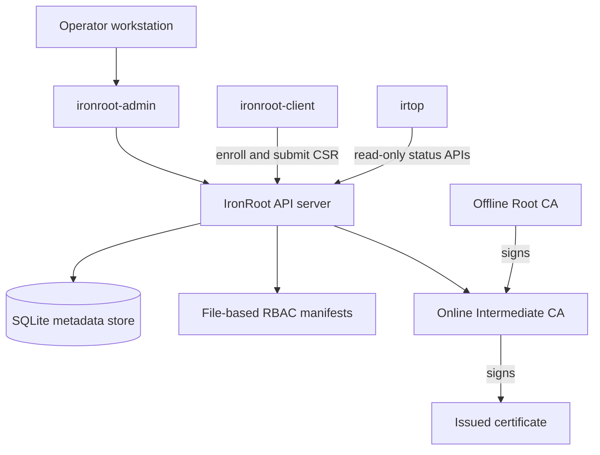

# 1. Introduction

<div class="ironroot-doc-meta" markdown>
<span class="ironroot-badge ironroot-badge--stage">Stage: Alpha</span>
<span class="ironroot-badge ironroot-badge--status ironroot-badge--in-progress">Status: In Progress</span>
</div>

IronRoot is an internal PKI platform for teams that need private trust infrastructure, offline Root CA handling, online Intermediate CAs, certificate automation, RBAC, auditability, and observability.

## Prerequisites

- You know what TLS certificates are used for.
- You do not need to know IronRoot internals yet.

## Core Terms

| Term | Meaning |
| --- | --- |
| Root CA | Offline trust anchor. It signs Intermediate CAs, not normal service certificates. |
| Intermediate CA | Online issuer used by the IronRoot server to sign certificates. |
| Enrollment | A client registration created with a bootstrap token. |
| Bootstrap token | Short-lived one-time token used to enroll a host. |
| Certificate request | A CSR submitted by a client. The private key stays on the client. |
| RBAC manifest | YAML file that defines users, groups, roles, bindings, CA scopes, and token policies. |
| `irtop` | Read-only terminal UI for health, hierarchy, RBAC, token, and certificate visibility. |

## Architecture Overview



## Local Versus Production

Local startup is optimized for learning:

- SQLite database in `.localdev/data`.
- PKI material in `.localdev/pki`.
- RBAC manifests in `.localdev/config/rbac`.
- HTTP API on `localhost:8443`.

Production requires stricter choices:

- Offline Root CA custody.
- Encrypted Intermediate key storage.
- reviewed RBAC manifests.
- TLS on the API endpoint.
- durable database/storage.
- backups, audit retention, metrics, and disaster recovery.

## Expected Outcome

You understand the main components and why Root CA, Intermediate CA, RBAC, and tokens are separate concepts.

## Validation

You should be able to explain this trust path:

```text
Root CA -> Intermediate CA -> issued certificate -> workload/browser/client trust
```

## Troubleshooting

If the terms feel too abstract, continue to [Install And First Startup](quick-start.md). The local workflow creates every component and makes the model concrete.
