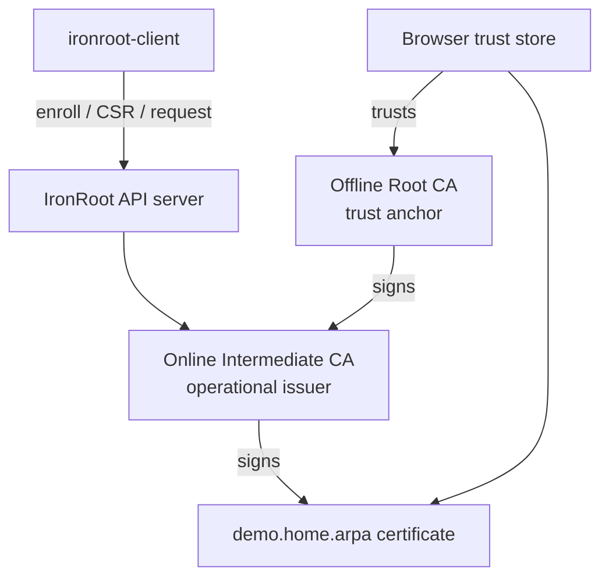
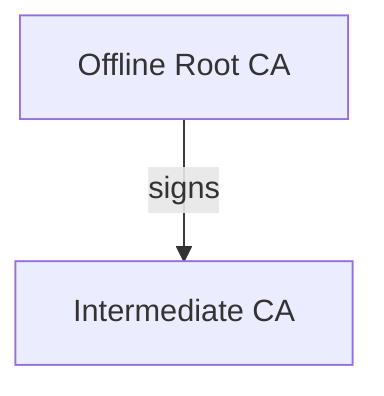
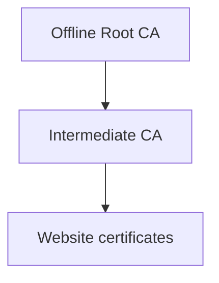
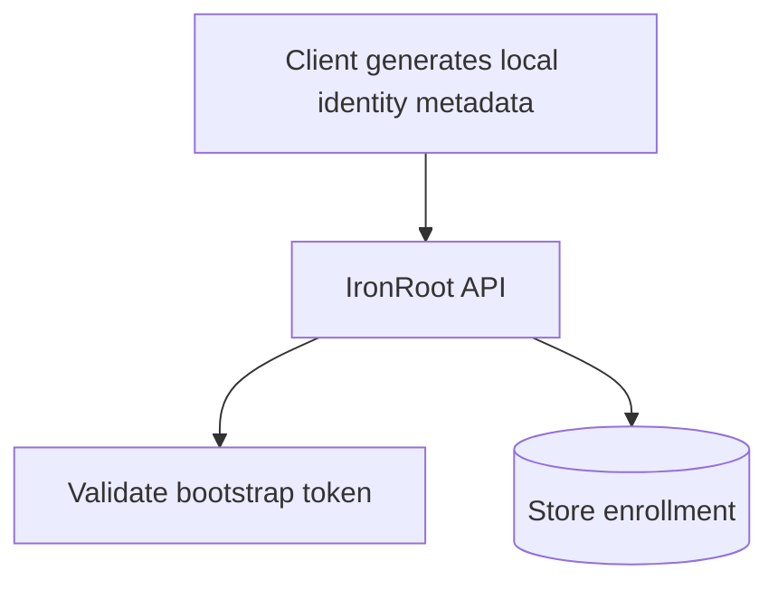
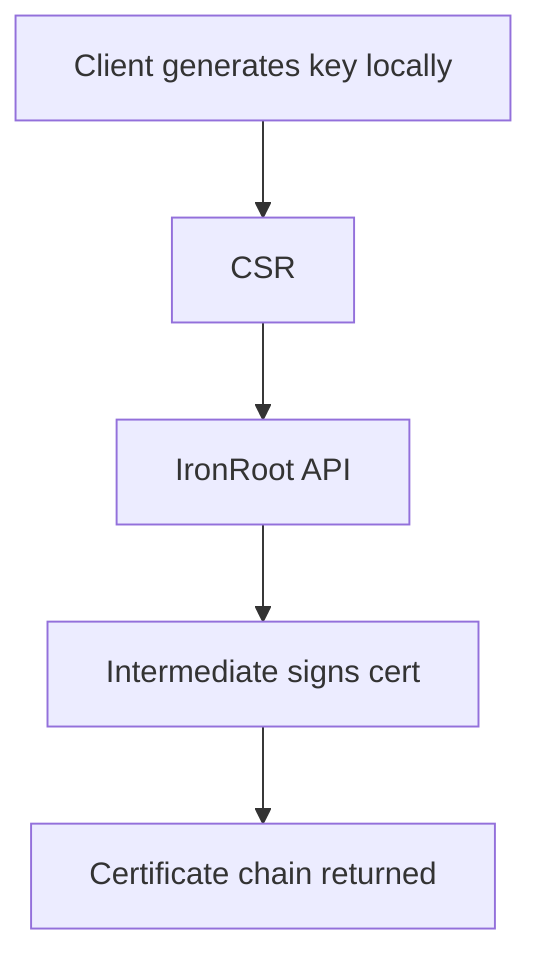
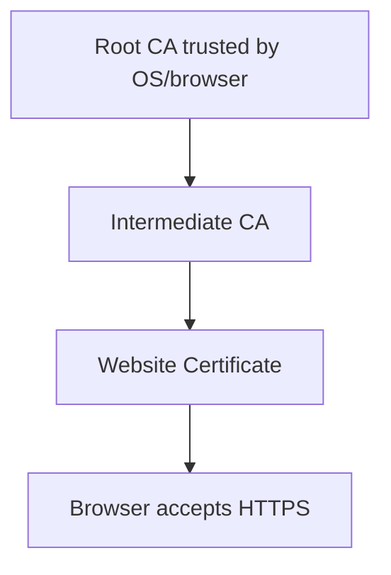

# Local Quick Start

<span class="ironroot-page-status ironroot-page-status--in-progress">Status: In progress</span>

This guide creates a complete local IronRoot PKI, issues a website certificate, installs the Root CA trust bundle, and opens a local HTTPS site without browser warnings.

!!! warning "Local demo only"
    The passwords below are intentionally simple so the flow is copyable. Do not reuse local demo keys or passwords in production.

## What You Are Building



Trust starts at the Root CA. The Root signs the Intermediate. IronRoot uses the Intermediate to sign website certificates. Your browser trusts the website certificate only after you install the Root CA into the local trust store.

## 1. Generate a Root CA

The Root CA is the trust anchor. In production it should live on an offline or air-gapped machine and should only sign Intermediate CAs.



```bash
ironroot-admin ca create-root \
  --name "IronRoot Local Root CA" \
  --key-password ironroot-local-root \
  --out ./pki/root
```

This beginner command still uses production-minded defaults: ECDSA P-384, 20 year validity, encrypted private key, max path length 1, and no leaf certificate usages on the Root CA.

It writes:

- `root-ca.key`: encrypted private key; keep offline in production.
- `root-ca.crt`: public Root CA certificate; distribute as trust material.
- `root-ca.pub`: public key.
- `root-ca.pem` and `root-ca.der`: export formats.
- `metadata.json`: Root CA settings and fingerprints.
- `fingerprints.txt`: SHA-256 fingerprint for verification.
- `recovery.txt`: backup and recovery reminders.
- `trust-bundle/root-ca.crt`: public trust bundle copy.

## 2. Generate an Intermediate CA

The Intermediate CA is the operational issuer. It lives on the IronRoot server and signs website/server certificates.



```bash
ironroot-admin ca create-intermediate \
  --root-cert ./pki/root/root-ca.crt \
  --root-key ./pki/root/root-ca.key \
  --root-password ironroot-local-root \
  --password ironroot-local-intermediate \
  --out ./pki/intermediate
```

Verify the CA chain:

```bash
ironroot-admin ca verify-chain \
  --root-cert ./pki/root/root-ca.crt \
  --intermediate-cert ./pki/intermediate/intermediate-ca.crt
```

## 3. Bootstrap IronRoot

```bash
ironroot-admin bootstrap \
  --config ./examples/config.local.yaml \
  --non-interactive \
  --acknowledge-risk \
  --output-checklist ./ironroot-security-checklist.md
```

## 4. Start the Server

```bash
ironroot-server --config ./examples/config.local.yaml
```

For the local demo the API uses HTTP on `localhost:8443`; the website certificate you request later is the browser-trusted HTTPS certificate.

## 5. Create a Bootstrap Token

```bash
ironroot-admin --config ./examples/config.local.yaml create-token \
  --host local-demo \
  --ttl 24h
```

Copy the returned token.

## 6. Enroll a Client



```bash
ironroot-client enroll \
  --server http://localhost:8443 \
  --token <token>
```

Copy the returned `enrollment_id`.

## 7. Request a Website TLS Certificate

The client generates the private key locally. The key never leaves your machine. Only the CSR is sent to IronRoot.



```bash
ironroot-client request-cert \
  --server http://localhost:8443 \
  --enrollment-id <enrollment_id> \
  --dns demo.home.arpa \
  --out ./certs
```

This writes:

- `certs/tls.key`
- `certs/tls.crt`
- `certs/ca-chain.crt`
- `certs/root-ca.crt`

Verify the full chain:

```bash
ironroot-admin ca verify-chain \
  --root-cert ./pki/root/root-ca.crt \
  --intermediate-cert ./pki/intermediate/intermediate-ca.crt \
  --cert ./certs/tls.crt
```

## 8. Point a Local Name at Your Machine

Prefer `demo.home.arpa` for local testing. The `.local` suffix can conflict with mDNS on macOS and many Linux desktops.

Add this to `/etc/hosts`:

```text
127.0.0.1 demo.home.arpa
```

## 9. Run a Local HTTPS Website

Nginx example:

```bash
podman build -f examples/nginx/Containerfile -t ironroot-nginx-demo examples/nginx
podman run --rm \
  -v ./certs:/certs:ro,Z \
  -p 8444:443 \
  ironroot-nginx-demo
```

Caddy example:

```bash
podman-compose -f examples/caddy/podman-compose.yaml up
```

Python example:

```bash
cd examples/python-https
python3 server.py
```

## 10. Install the Root CA Trust Bundle

Browser trust works because the browser builds this chain:



macOS:

```bash
sudo security add-trusted-cert -d -r trustRoot \
  -k /Library/Keychains/System.keychain ./pki/root/root-ca.crt
```

Debian/Ubuntu:

```bash
sudo cp ./pki/root/root-ca.crt /usr/local/share/ca-certificates/ironroot-local.crt
sudo update-ca-certificates
```

Fedora/RHEL:

```bash
sudo trust anchor ./pki/root/root-ca.crt
sudo update-ca-trust
```

Windows:

Open `mmc`, add the Certificates snap-in for the local computer, and import `root-ca.crt` into **Trusted Root Certification Authorities**.

Firefox:

Firefox may use its own trust store. Import `root-ca.crt` in **Settings → Privacy & Security → Certificates → View Certificates → Authorities**.

## 11. Open the Website

Open:

```text
https://demo.home.arpa:8444
```

You should see a valid HTTPS connection with no browser warning. The certificate should chain from `demo.home.arpa` to the IronRoot Intermediate CA and then to the IronRoot Local Root CA.

## How This Maps to Air-Gapped Production

In production:

- Generate and store the Root CA offline.
- Move only the Intermediate CSR to the offline machine.
- Sign the Intermediate offline.
- Move only the signed Intermediate certificate and trust bundle back to the online IronRoot server.
- Distribute the Root CA trust bundle through your approved offline package path.
- Never copy the Root CA private key to the server, Kubernetes, containers, or CI.
