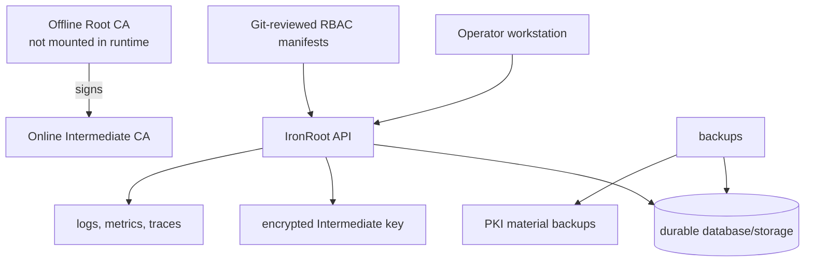

# 8. Production Deployment

<div class="ironroot-doc-meta" markdown>
<span class="ironroot-badge ironroot-badge--stage">Stage: Alpha</span>
<span class="ironroot-badge ironroot-badge--status ironroot-badge--in-progress">Status: In Progress</span>
</div>

This page turns the local mental model into a production checklist.

## Prerequisites

- Completed local startup and certificate workflow.
- Reviewed [RBAC And Security](rbac-security.md).
- Chosen a deployment model: binary, Podman, Kubernetes, or airgap.

## Production Architecture



## Required Production Decisions

| Area | Recommendation |
| --- | --- |
| Root CA | Generate and store offline. Do not mount Root private keys into the server. |
| Intermediate CA | Use encrypted private keys, restricted filesystem permissions, and planned rotation. |
| API TLS | Terminate TLS at the server or a trusted reverse proxy. |
| Database | Use durable storage and tested backups. |
| RBAC | Use reviewed YAML manifests; do not use manual SQL as the normal workflow. |
| Secrets | Use environment injection, secret manager, or mounted secret files. |
| Observability | Enable logs, metrics, traces, dashboards, and alerts. |
| Recovery | Test restore and disaster recovery before production issuance. |

## Production Config Shape

```yaml
server:
  address: ":8443"
  tls:
    cert_file: /etc/ironroot/tls/tls.crt
    key_file: /etc/ironroot/tls/tls.key

database:
  driver: sqlite
  dsn: "file:/var/lib/ironroot/ironroot.db?_foreign_keys=on"

pki:
  root_file: /etc/ironroot/pki/root-ca.crt
  chain_file: /etc/ironroot/pki/ca-chain.crt
  intermediate_cert_file: /etc/ironroot/pki/intermediate-ca.crt
  intermediate_key_file: /etc/ironroot/pki/intermediate-ca.key
  intermediate_key_pass: ""
  default_lifetime: 2160h
  renew_before: 720h

rbac:
  enabled: true
  mode: file
  paths:
    - /etc/ironroot/rbac/*.yaml
    - /etc/ironroot/rbac/*.yml

telemetry:
  enabled: true
  deployment_environment: production
```

Set the Intermediate key password outside the file, for example with `IRONROOT_PKI_INTERMEDIATE_KEY_PASS` from your service manager, container runtime, or secret manager. Avoid committing private key passwords to Git.

## Deployment References

- [Binary Installation](../installation/binary.md)
- [Podman Installation](../podman/index.md)
- [Kubernetes Helm](../kubernetes/helm-installation.md)
- [Airgap Overview](../airgap/overview.md)
- [Backups](../operations/backups.md)
- [Disaster Recovery](../operations/disaster-recovery.md)
- [Security Check](../security/security-check.md)

## Expected Outcome

You have a production checklist and know which local shortcuts must be replaced before real issuance.

## Validation

Before production issuance:

```bash
ironroot-admin security-check --config /etc/ironroot/config.yaml
ironroot-admin bootstrap --config /etc/ironroot/config.yaml
```

Then verify:

```bash
curl https://<ironroot-api>/healthz
irtop --profile production
```

## Troubleshooting

| Symptom | Check |
| --- | --- |
| API starts without TLS | Confirm `server.tls.cert_file` and `server.tls.key_file`, or document reverse proxy TLS. |
| Restore untested | Run a restore drill before issuing production certificates. |
| RBAC differs from Git | Treat the deployment as drifted and reconcile through reviewed manifests. |
| Intermediate key inaccessible | Check mount paths, permissions, and password source. |

## Next Step

Continue to [Advanced Architecture](advanced-architecture.md).
