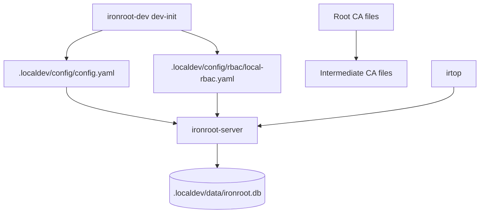

# 2. Install And First Startup

<div class="ironroot-doc-meta" markdown>
<span class="ironroot-badge ironroot-badge--stage">Stage: Alpha</span>
<span class="ironroot-badge ironroot-badge--status ironroot-badge--in-progress">Status: In Progress</span>
</div>

This page takes you from a clean checkout to a running local IronRoot server.

## Prerequisites

- Git
- Go
- Just
- `curl`
- Optional: `jq` for prettier API output

## 1. Build Local Commands

```bash
git clone https://github.com/parisnakitakejser/ironroot.git
cd ironroot
just install-local
```

This installs local development commands such as `ironroot-server`, `ironroot-admin`, `ironroot-client`, `ironroot-dev`, and `irtop` into your Go binary path.

Validate:

```bash
ironroot-server --help
ironroot-admin --help
ironroot-client --help
```

## 2. Create Local Workspace Files

```bash
ironroot-dev dev-init
```

This creates `.localdev/` with:

```text
.localdev/
  config/config.yaml
  config/rbac/local-rbac.yaml
  data/
  pki/
  certs/
  logs/
```

## 3. Create Local CA Material

Create the Root CA:

```bash
ironroot-admin ca create-root \
  --name "IronRoot Local Root CA" \
  --key-password ironroot-local-root \
  --out .localdev/pki/root
```

Create the Intermediate CA:

```bash
ironroot-admin ca create-intermediate \
  --root-cert .localdev/pki/root/root-ca.crt \
  --root-key .localdev/pki/root/root-ca.key \
  --root-password ironroot-local-root \
  --password ironroot-local-intermediate \
  --out .localdev/pki/intermediate
```

!!! warning "Local passwords only"
    These passwords are intentionally copyable for local learning. Use environment variables, password files, or a secret manager for real deployments.

## 4. Bootstrap The Database

```bash
ironroot-admin bootstrap \
  --config .localdev/config/config.yaml \
  --non-interactive \
  --acknowledge-risk
```

Bootstrap applies database migrations and validates the local server configuration.

## 5. Start The Server

```bash
ironroot-server --config .localdev/config/config.yaml
```

Keep this terminal open. In a second terminal, verify health:

```bash
curl http://localhost:8443/healthz
```

Expected response:

```text
ok
```

## 6. Open The Terminal UI

```bash
irtop --server http://localhost:8443
```

You should see a loading screen first, then a populated dashboard. Press `5` to view the CA hierarchy.

## What Is Happening Internally



The server loads `config.yaml`, opens SQLite, applies migrations, loads RBAC manifests, loads Intermediate CA material, and exposes health/status APIs.

## Expected Outcome

- `ironroot-server` is running on `http://localhost:8443`.
- `curl http://localhost:8443/healthz` returns `ok`.
- `irtop` opens and can display CA Health.

## Troubleshooting

| Symptom | Check |
| --- | --- |
| `command not found` | Ensure your Go binary path is on `PATH`, then rerun `just install-local`. |
| `address already in use` | Another process is using port `8443`; stop it or change `server.address`. |
| RBAC startup error | Validate files under `.localdev/config/rbac/`; the server fails closed for invalid manifests. |
| missing PKI file | Recreate Root/Intermediate CA files or check the paths in `.localdev/config/config.yaml`. |

## Next Step

Continue to [First Configuration](setup.md).
```
