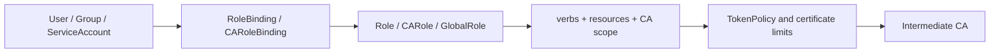

# 6. RBAC And Security

<div class="ironroot-doc-meta" markdown>
<span class="ironroot-badge ironroot-badge--stage">Stage: Alpha</span>
<span class="ironroot-badge ironroot-badge--status ironroot-badge--in-progress">Status: In Progress</span>
</div>

IronRoot RBAC follows a Kubernetes-style mindset: define identities, define permissions, then bind them together.

## Prerequisites

- Read [First Configuration](setup.md).
- Have a local RBAC file under `.localdev/config/rbac/`.

## Security Model



## Resource Types

RBAC manifests can define:

- `User`
- `Group`
- `ServiceAccount`
- `Role`
- `RoleBinding`
- `CARole`
- `CARoleBinding`
- `GlobalRole`
- `GlobalRoleBinding`
- `RootCA`
- `IntermediateCA`
- `TokenPolicy`

## Least-Privilege Example

```yaml
apiVersion: ironroot.io/v1alpha1
kind: TokenPolicy
metadata:
  name: platform-web-short-lived
spec:
  intermediateRef: local-intermediate
  certificateTypes: ["server"]
  allowedDNS:
    - "*.platform.home.arpa"
  maxTTL: 24h
  maxIssuances: 10
  allowRenewal: true
---
apiVersion: ironroot.io/v1alpha1
kind: CARole
metadata:
  name: platform-web-issuer
spec:
  rules:
    - resources: ["certificates"]
      verbs: ["request", "renew", "view"]
      intermediateRef: local-intermediate
---
apiVersion: ironroot.io/v1alpha1
kind: CARoleBinding
metadata:
  name: platform-web-issuer-binding
spec:
  roleRef:
    kind: CARole
    name: platform-web-issuer
  subjects:
    - kind: Group
      name: platform
```

## Certificate Permissions

Use explicit verbs for certificate operations:

| Verb | Meaning |
| --- | --- |
| `request` | Request a new certificate. |
| `renew` | Renew an existing certificate. |
| `revoke` | Revoke a certificate. |
| `view` | View metadata and status. |
| `manage-intermediate` | Manage an Intermediate CA. |
| `manage-root` | Manage Root CA metadata and lifecycle. |
| `request-token` | Request a short-lived/request-scoped token. |

## Production Rules

- Do not grant broad certificate request access by default.
- Scope roles to Intermediate CAs where possible.
- Constrain DNS SANs and certificate lifetimes in token policies.
- Review RBAC manifests in pull requests.
- Keep Root CA private keys offline.
- Keep Intermediate private keys encrypted and tightly permissioned.
- Monitor invalid token attempts and unexpected issuance.

## Expected Outcome

You understand that enrollment, RBAC, token policy, and certificate issuance are separate controls.

## Validation

```bash
curl -s http://localhost:8443/v1/status/ca-hierarchy | jq '.summary'
```

The summary should show loaded roles and token policies when RBAC is enabled.

## Troubleshooting

| Symptom | Check |
| --- | --- |
| Server fails on startup | RBAC manifests are validated before apply; inspect the first `load RBAC manifests` error. |
| Binding does not work | Confirm `roleRef.kind`, `roleRef.name`, and subject names match exactly. |
| Policy too broad | Prefer specific `intermediateRef`, `certificateTypes`, `allowedDNS`, and short `maxTTL`. |

## Next Step

Continue to [Infrastructure As Code](iac.md).
