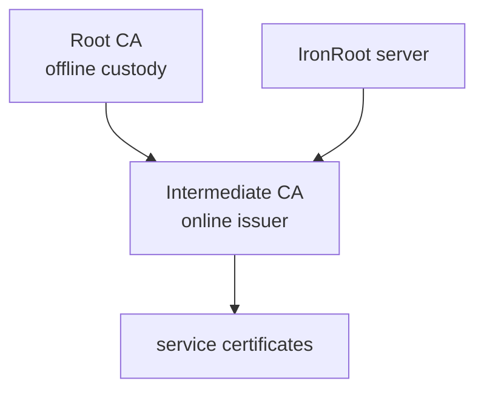

# 3. First Configuration

<div class="ironroot-doc-meta" markdown>
<span class="ironroot-badge ironroot-badge--stage">Stage: Alpha</span>
<span class="ironroot-badge ironroot-badge--status ironroot-badge--in-progress">Status: In Progress</span>
</div>

This page explains the generated local `config.yaml` and the first concepts you must understand before issuing certificates.

## Prerequisites

- Complete [Install And First Startup](quick-start.md).
- Keep `.localdev/config/config.yaml` available.

## Main Server Config

Local development config follows this shape:

```yaml
server:
  address: ":8443"

database:
  driver: sqlite
  dsn: "file:.localdev/data/ironroot.db?_foreign_keys=on"

pki:
  root_file: .localdev/pki/root/root-ca.crt
  chain_file: .localdev/pki/intermediate/ca-chain.crt
  intermediate_cert_file: .localdev/pki/intermediate/intermediate-ca.crt
  intermediate_key_file: .localdev/pki/intermediate/intermediate-ca.key
  intermediate_key_pass: ironroot-local-intermediate
  default_lifetime: 2160h
  renew_before: 720h

rbac:
  enabled: true
  mode: file
  paths:
    - .localdev/config/rbac/*.yaml
    - .localdev/config/rbac/*.yml

telemetry:
  enabled: false

log:
  level: info
```

## Configuration Sections

| Section | Purpose |
| --- | --- |
| `server` | API listen address and optional runtime TLS files. |
| `database` | Metadata store. Local development uses SQLite. |
| `pki` | Root trust bundle, Intermediate CA certificate, chain, encrypted key, and certificate lifetimes. |
| `rbac` | Declarative authorization manifests loaded on startup. |
| `telemetry` | OpenTelemetry traces, metrics, logs, and Prometheus settings. |
| `log` | Runtime log level. |

## Root And Intermediate CA Setup

IronRoot separates trust anchor custody from online issuance:



The server needs the Root certificate, Intermediate certificate, Intermediate key, and CA chain. The Root private key should not be mounted into the server in production.

## RBAC Basics

RBAC is Kubernetes-inspired and file-based:

```yaml
apiVersion: ironroot.io/v1alpha1
kind: CARole
metadata:
  name: local-platform-issuer
spec:
  rules:
    - resources: ["certificates"]
      verbs: ["request", "renew", "view"]
      intermediateRef: local-intermediate
---
apiVersion: ironroot.io/v1alpha1
kind: CARoleBinding
metadata:
  name: local-platform-issuer-binding
spec:
  roleRef:
    kind: CARole
    name: local-platform-issuer
  subjects:
    - kind: Group
      name: platform
```

The database can store loaded RBAC metadata internally, but YAML manifests are the user-facing source of truth.

## Token Basics

Bootstrap tokens enroll hosts. They are short-lived, host-scoped, and printed once:

```bash
ironroot-admin --config .localdev/config/config.yaml create-token \
  --host local-demo \
  --ttl 1h
```

Use the token only with `ironroot-client enroll`. Certificate requests use the returned `enrollment_id`, not the bootstrap token.

## irtop Profile Config

`irtop` can also load operator profiles from `~/.ironroot/config`:

```yaml
default_profile: local
profiles:
  local:
    server: http://localhost:8443
    token: ""
    refresh: 5s
    default_view: overview
    output: tui
  staging:
    server: https://ironroot.staging.example.com
    token: "replace-with-read-only-token"
    refresh: 5s
    default_view: ca-health
    output: tui
```

Use `irtop --profile staging` to select a profile at startup. You can switch profiles inside the TUI without restarting.

## Expected Outcome

You understand which file configures the server, which files define RBAC, which CA files the server needs, and how tokens differ from enrollments.

## Validation

```bash
ironroot-admin --config .localdev/config/config.yaml list-tokens
curl -s http://localhost:8443/v1/status/ca-hierarchy
```

The hierarchy endpoint should return JSON with Root CA, Intermediate CA, RBAC role, and token policy metadata.

## Troubleshooting

| Symptom | Check |
| --- | --- |
| Server starts with default `/pki` paths | Confirm you passed `--config .localdev/config/config.yaml`. |
| Token works against one server but not another | Ensure `ironroot-admin` and `ironroot-server` use the same database DSN. |
| RBAC file ignored | Check `rbac.enabled`, `rbac.mode`, and `rbac.paths`. |
| `irtop` cannot find config | `~/.ironroot/config` is optional; pass `--server` directly for local use. |

## Next Step

Continue to [Terminal UI Walkthrough](terminal-ui.md).
