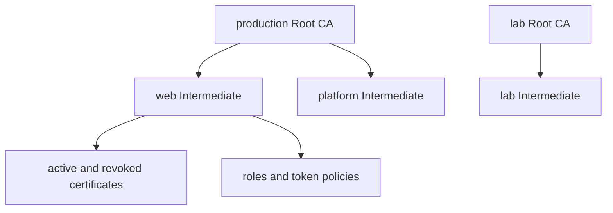

# 4. Terminal UI Walkthrough

<div class="ironroot-doc-meta" markdown>
<span class="ironroot-badge ironroot-badge--stage">Stage: Alpha</span>
<span class="ironroot-badge ironroot-badge--status ironroot-badge--in-progress">Status: In Progress</span>
</div>

`irtop` is IronRoot Top: a read-only terminal UI for operators.

## Prerequisites

- A running IronRoot server from [Install And First Startup](quick-start.md).
- Optional `~/.ironroot/config` if you want named profiles.

## Start irtop

```bash
irtop --server http://localhost:8443
```

With profiles:

```bash
irtop --profile local
```

## Layout

The UI shows:

- active profile and server endpoint.
- loading, loaded, empty, and error states.
- health summaries.
- CA hierarchy.
- certificate and token activity.
- RBAC/access state.
- telemetry and audit signals where available.

## Keyboard Navigation

| Key | Action |
| --- | --- |
| `1` | Overview |
| `2` | Certificates |
| `3` | Enrollments |
| `4` | Tokens |
| `5` | CA Health and hierarchy |
| `[` / `]` | Switch profile when multiple profiles exist |
| `r` | Refresh data |
| `q` | Quit |

## CA Hierarchy View



The CA Health view displays Root CAs, Intermediate CA chains, active and revoked certificate counts, RBAC roles, token policy counts, owner/namespace metadata, expiration health, and renewal/approval state.

## Expected Outcome

You can open `irtop`, identify the active profile, switch profiles, and inspect the CA hierarchy without restarting the process.

## Validation

```bash
irtop --server http://localhost:8443
```

Then press `5`. You should see at least one Root CA and one Intermediate CA in the local environment.

## Troubleshooting

| Symptom | Check |
| --- | --- |
| Empty screen | Wait for the loading state to finish; if it fails, the UI should show an error state. |
| Profile missing | Check `~/.ironroot/config` uses `profiles:` with named entries. |
| Wrong profile selected | Use `--profile <name>` or switch with `[` and `]`. |
| CA view empty | Verify `/v1/status/ca-hierarchy` returns data from the server. |

## Next Step

Continue to [Certificate Workflows](certificate-workflows.md).
