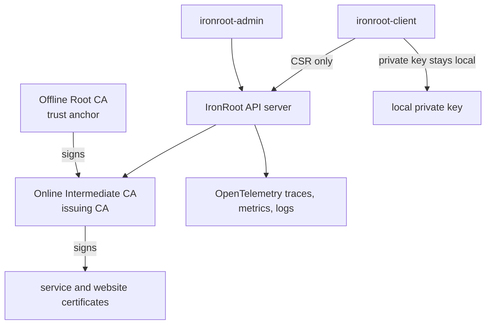

# IronRoot

Stage: Alpha
Status: Draft

**Airgap-first trust infrastructure**

IronRoot is a modern internal PKI platform for offline-root security, online issuing CAs, observable certificate operations, Kubernetes-native deployment, Podman workflows, and self-hosted infrastructure.

!!! note "Project maturity"
    IronRoot is currently Alpha-stage. The documentation is actively evolving, and most pages are marked `Stage: Alpha` until their workflows are fully validated. Start with the [Getting Started journey](getting-started/index.md) for the clearest path from first startup to production planning.

[Start the getting started journey](getting-started/index.md){ .md-button .md-button--primary }
[Read the architecture](architecture/index.md){ .md-button }

## Architecture At A Glance

## Why IronRoot Exists

Many teams need internal TLS and machine identity without outsourcing trust, exposing Root CA keys, or adopting a heavyweight enterprise PKI stack. IronRoot is built for platform engineers, homelab operators, Kubernetes users, and air-gapped environments that need automation with clear trust boundaries.

## The Name

**Iron** means hardened infrastructure, durability, security, industrial-grade systems, and an airgap-first mindset.

**Root** means Root CA, trust anchor, certificate trust chain, and identity foundation.

Together, **IronRoot represents hardened trust infrastructure designed for modern self-hosted and air-gapped environments.**

## Start Here

- [Getting Started](getting-started/index.md): follow the complete beginner-to-production onboarding path.
- [Install And First Startup](getting-started/quick-start.md): install tools, generate local config, start the server, and verify health.
- [Local Browser Certificate Demo](getting-started/local-quickstart.md): issue a browser-trusted local website certificate.
- [Local Development](contributing/local-development.md): primary validated contributor and local testing workflow.
- [Binary Installation](installation/binary.md): run IronRoot directly on a host.
- [Podman Installation](podman/index.md): run with mounted config, data, and PKI material.
- [Kubernetes Helm](kubernetes/helm-installation.md): deploy the server with Kubernetes-native resources.
- [Airgap Overview](airgap/overview.md): understand offline signing and controlled artifact movement.
- [Security Bootstrap](security/bootstrap-guide.md): walk through first-run hardening.

## Deployment Options

| Method | Use when |
| --- | --- |
| Binary | You want direct host control and systemd-style operations. |
| Podman | You want rootless container workflows with mounted state. |
| Kubernetes | You want declarative deployment, PVCs, Secrets, ServiceMonitor, and NetworkPolicy. |
| Airgap | You need controlled software and trust movement without Internet access. |

## Observability First

IronRoot emits OpenTelemetry traces, metrics, and JSON logs. CLI traces propagate to the server, API requests are measured, certificate operations have counters, and logs include trace correlation fields.

## Security First

The Root CA private key should stay offline. The Intermediate CA is the online issuer and must be encrypted at rest with restricted permissions. Clients generate private keys locally and send CSRs only.
