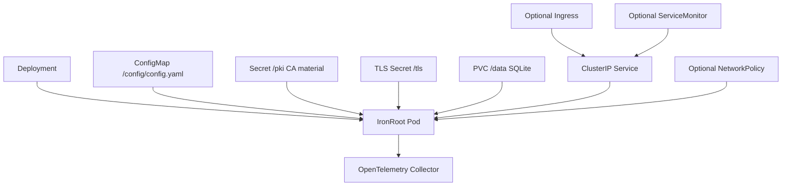

# Kubernetes

<span class="ironroot-page-status ironroot-page-status--in-progress">Status: In progress</span>

Apply the sample manifests:

```bash
kubectl apply -k deploy/kubernetes
```

The deployment includes:

- Deployment and Service
- Secret for CA material
- ConfigMap for config
- PVC for SQLite data
- Readiness and liveness probes
- Non-root security context
- Dropped Linux capabilities
- OpenTelemetry environment variables

PostgreSQL configuration values are reserved for a future backend implementation.

For Helm-based installs, see [Helm Installation](helm-installation.md).

## Kubernetes Architecture



## Resource Responsibilities

| Resource | Responsibility |
| --- | --- |
| Deployment | Runs `ironroot-server` with security context and probes |
| Service | Provides stable internal API endpoint |
| Secret | Mounts Intermediate CA material and API TLS material |
| ConfigMap | Provides `/config/config.yaml` |
| PVC | Persists SQLite database under `/data` |
| Ingress | Optional external routing, should terminate or pass through TLS intentionally |
| NetworkPolicy | Restricts which pods/namespaces can reach the API |
| ServiceMonitor | Allows Prometheus Operator scraping when enabled |

## Security Responsibilities

- Do not put the Root CA private key in Kubernetes.
- Restrict access to the Intermediate CA Secret.
- Use `runAsNonRoot`, dropped capabilities, and `readOnlyRootFilesystem`.
- Use a PVC for SQLite data.
- Prefer ClusterIP and internal access.
- Add NetworkPolicy before multi-tenant use.
- Keep CA material mounted as Secrets, not baked into images.
