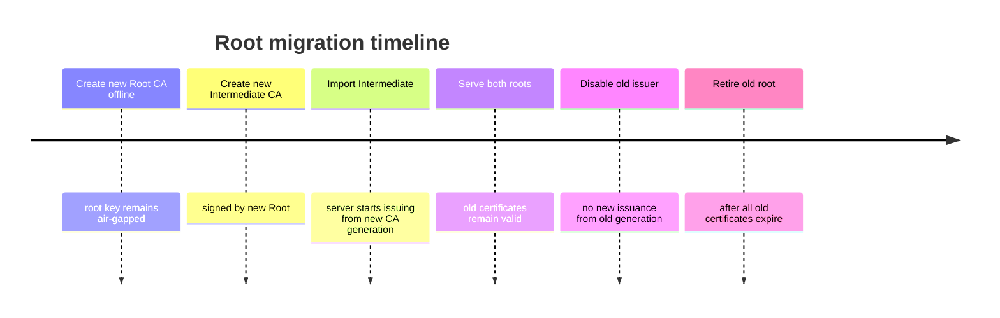

# Root Migration

Status: In progress

IronRoot is designed for staged Root CA migration:

```mermaid
timeline
  title Root migration timeline
  Create new Root CA offline : root key remains air-gapped
  Create new Intermediate CA : signed by new Root
  Import Intermediate : server starts issuing from new CA generation
  Serve both roots : old certificates remain valid
  Disable old issuer : no new issuance from old generation
  Retire old root : after all old certificates expire
```

The database stores multiple CA generations with active, disabled, and retired states.

