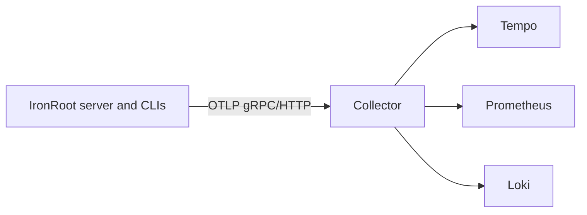

# OpenTelemetry Collector

Status: In progress

The collector receives OTLP telemetry from IronRoot and forwards it to storage backends.

Local examples live in `examples/otel/`. Start with `examples/otel/otel-collector.yaml` and point IronRoot at `localhost:4317` for binary deployment or `host.containers.internal:4317` for Podman.

In production, run a collector close to IronRoot, restrict network access, and avoid exporting telemetry across an air gap unless the path is approved.
