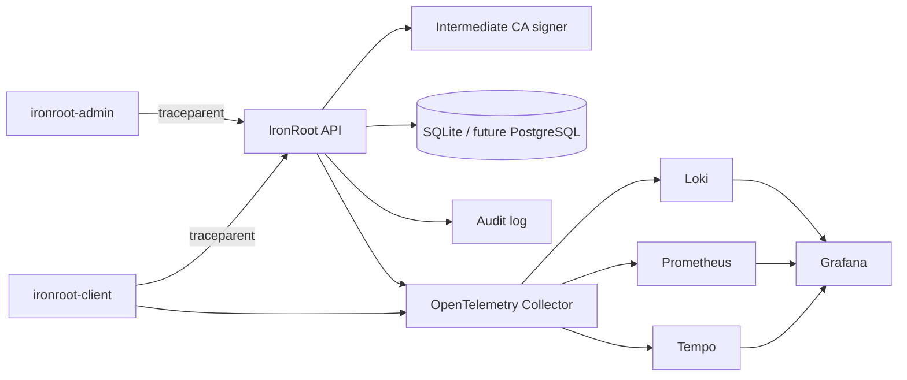

# Observability Overview

Status: In progress

IronRoot treats observability as part of the PKI control plane. Certificate enrollment, issuance, renewal, revocation, audit writes, database operations, bootstrap, and security checks emit telemetry so operators can understand trust operations without exposing secrets.

Telemetry is generated by:

- `ironroot-client` and `ironroot-admin` CLI commands.
- `ironroot-server` REST API middleware and handlers.
- Enrollment, CSR validation, signing, renewal, revocation, audit, and storage components.
- Security bootstrap and security-check workflows.

IronRoot supports W3C Trace Context, OTLP gRPC, OTLP HTTP, Prometheus metrics, and JSON logs with `trace_id` and `span_id`.

Use observability to answer operational questions:

- Why did an enrollment fail?
- Which certificate requests are slow?
- Are bootstrap token validation failures increasing?
- Is the Intermediate CA close to expiry?
- Is telemetry export itself healthy?

Telemetry must not contain private keys, bootstrap token values, or sensitive certificate material.
