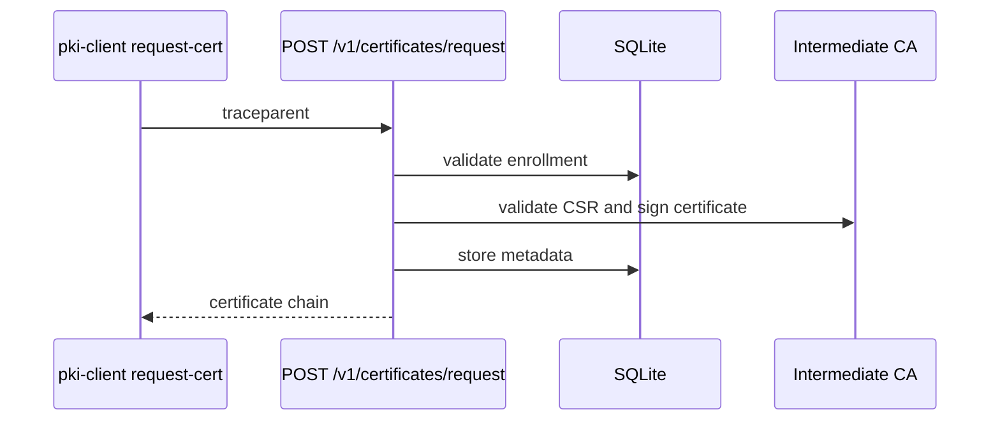

# OpenTelemetry

IronRoot is OpenTelemetry-first.

Server-side telemetry includes endpoint tracing, request duration, status code metrics, and structured logs with trace and span IDs.

Client-side telemetry creates a root span per command, records command duration, tracks errors, and propagates trace context to the server.

Supported configuration includes service name, service version, deployment environment, OTLP endpoint, OTLP protocol, and sampling ratio.

