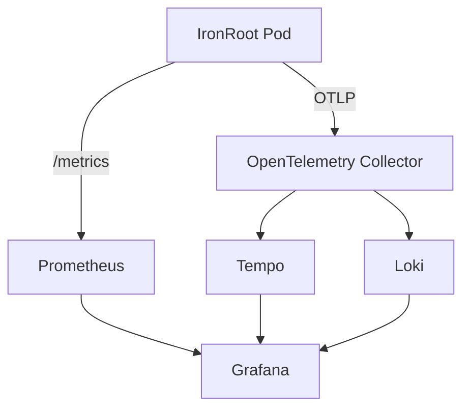

# Kubernetes Observability

The Helm chart supports OTEL environment variables, `/metrics`, ServiceMonitor, and Prometheus scrape annotations.

```yaml
config:
  telemetry:
    enabled: true
    endpoint: opentelemetry-collector.observability.svc:4317
    protocol: grpc
    serviceName: ironroot
    environment: production
    samplingRatio: 0.25
serviceMonitor:
  enabled: true
```



Keep the Root CA out of Kubernetes. Restrict access to the Intermediate CA Secret, use NetworkPolicy, and run with non-root security contexts.
