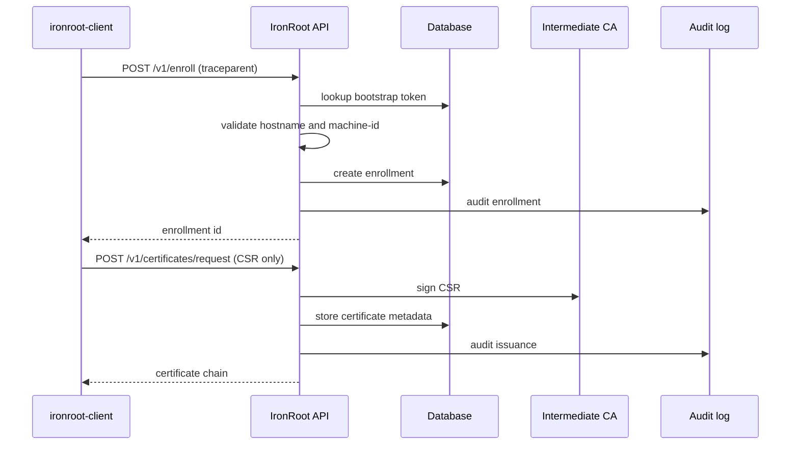

# Traces

IronRoot creates one root span per CLI command and continues that trace through HTTP requests with W3C `traceparent` headers. The server creates spans for request handling and internal PKI operations.

Important spans include:

- `cli.command`
- `bootstrap.workflow`
- `security_check.workflow`
- `enrollment.workflow`
- `enrollment.validate_bootstrap_token`
- `certificate.issue.workflow`
- `certificate.renew.workflow`
- `certificate.revoke.workflow`
- `ca.sign_csr`
- `audit.write`
- `db.*`

Enrollment trace:

Good traces have clear parent-child relationships from CLI to server. Broken traces usually mean a proxy stripped `traceparent`, telemetry was disabled in the CLI, or the server and client are using different telemetry settings.
