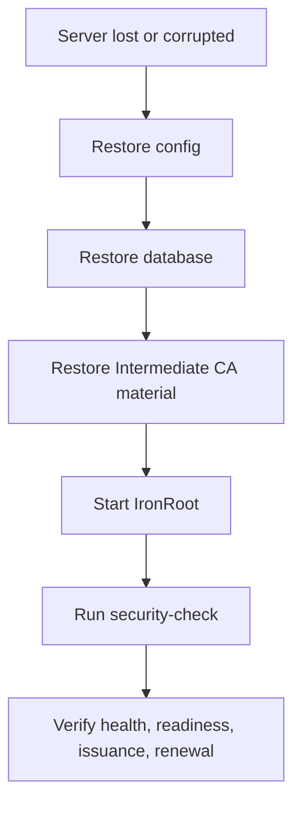

# Operations

Stage: Alpha
Status: Draft

Operating IronRoot safely means treating it as trust infrastructure, not just another internal API.

## Operational Responsibilities

- Back up the database and Intermediate CA material together.
- Keep the Root CA private key offline and encrypted.
- Rotate server certificates before expiry.
- Plan Intermediate rotation before the Intermediate expires.
- Use Root migration when changing trust anchors.
- Monitor enrollment, issuance, renewal, and revocation activity.
- Run `ironroot-admin security-check` after deployment changes.

## Backup Strategy

Back up:

- `/config/config.yaml`
- SQLite database under `/data` or `/var/lib/ironroot`
- `/pki/root-ca.crt`
- `/pki/ca-chain.crt`
- `/pki/intermediate.crt`
- encrypted `/pki/intermediate.key`

Do not back up the offline Root CA private key with online server backups. Root backups should follow the offline backup process in the Offline Root CA docs.

## Disaster Recovery

Restore the database and Intermediate CA material from the same recovery point whenever possible.

## Certificate Rotation

Normal server certificates should be short-lived, with a 90 day default and renewal before the last 30 days. Clients generate a new private key and CSR locally, then call the renew endpoint.

## Intermediate Rotation

1. Generate a new Intermediate key and CSR.
2. Sign the CSR with the offline Root CA.
3. Mount the new Intermediate certificate and key into IronRoot.
4. Mark the new CA generation active when the management workflow supports it.
5. Disable the old issuer after new issuance moves to the new Intermediate.
6. Retire the old issuer after old certificates expire.

## Troubleshooting

Startup failures:

- check `IRONROOT_CONFIG`
- verify `/config/config.yaml` is readable
- verify SQLite path is writable
- verify Intermediate certificate and key paths exist

TLS failures:

- verify `server.tls.cert_file` and `server.tls.key_file`
- verify certificate expiry
- verify clients trust `root-ca.crt` and `ca-chain.crt`

Enrollment failures:

- verify bootstrap token has not expired
- verify hostname matches token hostname
- verify machine ID is present
- check audit logs and API structured logs

Certificate request failures:

- verify enrollment ID
- verify CSR signature
- verify DNS names are valid
- verify Intermediate CA is not expired
