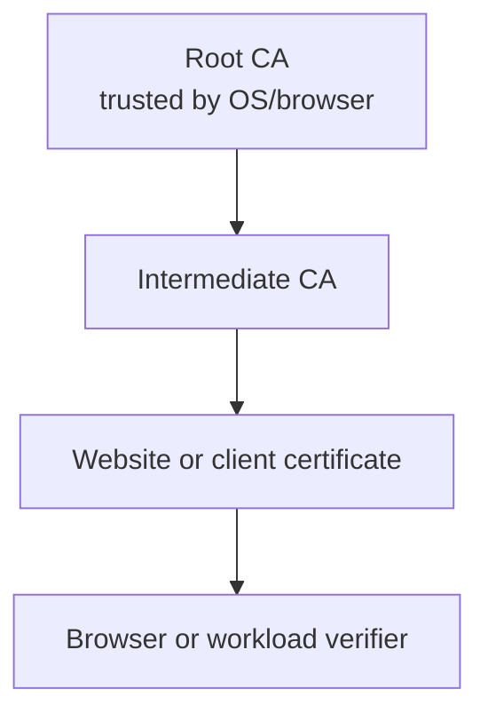

# Certificate Chain

<div class="ironroot-doc-meta" markdown>
<span class="ironroot-badge ironroot-badge--stage">Stage: Alpha</span>
<span class="ironroot-badge ironroot-badge--status">Status: Draft</span>
</div>

IronRoot certificates are validated as a chain:



A verifier does not need the private key for any CA. It needs the public Root CA certificate in a trust store and the Intermediate certificate in the served chain.

## Browser Trust

For local testing, install `root-ca.crt` or `trust-bundle/root-ca.crt` into the OS or browser trust store. The browser then validates:

1. The website certificate matches the DNS name.
2. The website certificate was signed by the Intermediate.
3. The Intermediate was signed by the trusted Root.
4. None of the certificates are expired.

## Verify A Chain

```bash
ironroot-admin ca verify-chain \
  --root-cert ./pki/root/root-ca.crt \
  --intermediate-cert ./pki/intermediate/intermediate-ca.crt \
  --cert ./certs/tls.crt
```
