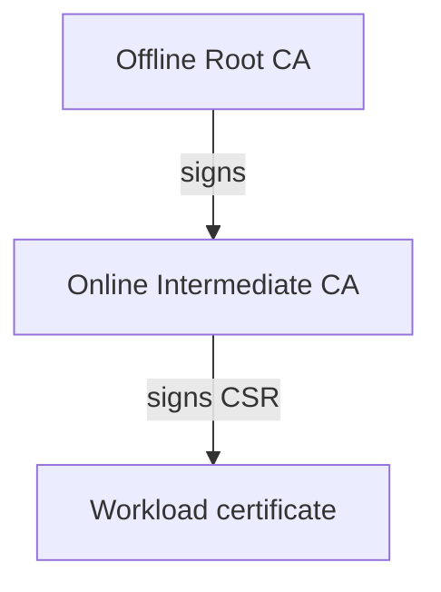

# Intermediate CA

Stage: Alpha
Status: Draft

The Intermediate CA is the operational issuer. It lives with the IronRoot server because automated enrollment and renewal need an online signer.

The Intermediate protects the Root CA by keeping the long-lived trust anchor offline. If the online environment is compromised, operators can retire the Intermediate and create a new one from the offline Root.

Recommended defaults:

| Setting | Recommendation |
|---|---|
| Algorithm | ECDSA |
| Curve | P-256 |
| Lifetime | 5 years |
| Storage | Encrypted at rest |
| Permissions | Owner-readable only |
| Backup | Encrypted backup with database state |

The Intermediate private key is sensitive and belongs only on the IronRoot server or in the approved server Secret for Kubernetes. The Root CA private key does not belong there.
