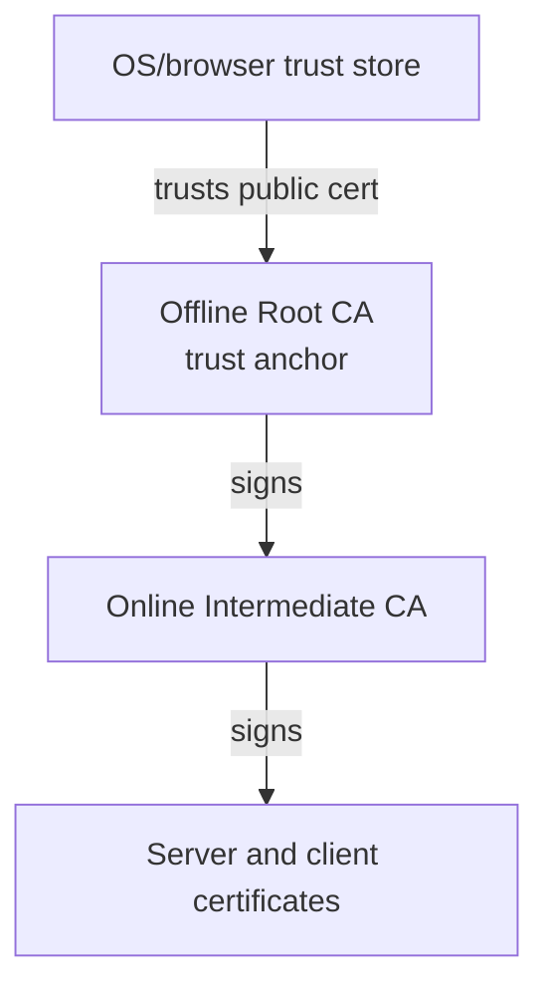

# Root CA

<div class="ironroot-doc-meta" markdown>
<span class="ironroot-badge ironroot-badge--stage">Stage: Alpha</span>
<span class="ironroot-badge ironroot-badge--status">Status: Draft</span>
</div>

The Root CA is the trust anchor for an IronRoot deployment. Systems trust IronRoot-issued certificates because they trust the Root CA certificate and can validate a chain through the Intermediate CA.



The Root CA private key should not run continuously. In production it should live on an offline or air-gapped machine and should only be used to sign Intermediate CA certificates.

Never place the Root CA private key on the IronRoot server, in Kubernetes, in a container image, in CI, or in support bundles.

## Create A Beginner Root CA

```bash
ironroot-admin ca create-root \
  --name "IronRoot Local Root CA" \
  --out .localdev/pki/root
```

This uses secure defaults and generates a password file when no password source is provided.

## Create A Production Root CA

```bash
ROOT_CA_PASSWORD="<strong-password>" ironroot-admin ca create-root \
  --name "IronRoot Production Root CA" \
  --common-name "IronRoot Root CA" \
  --organization "IronRoot" \
  --organizational-unit "Security" \
  --country "DK" \
  --province "Hovedstaden" \
  --locality "Copenhagen" \
  --algorithm ecdsa \
  --curve p384 \
  --validity 20y \
  --max-path-length 1 \
  --key-password-env ROOT_CA_PASSWORD \
  --encrypt-key \
  --offline \
  --out ./pki/root
```

## Defaults

| Setting | Default | Why |
|---|---:|---|
| Algorithm | `ecdsa` | Modern, compact keys and signatures. |
| Curve | `p384` | Strong default for a long-lived Root CA. |
| RSA bits | `4096` | Used only when `--algorithm rsa`. |
| Validity | `20y` | Long-lived trust anchor with planned migration. |
| Encrypted key | `true` | Root private key must be protected at rest. |
| Max path length | `1` | Allows Intermediate CAs, not deeper CA trees. |
| Server/client auth | `false` | Root CA should not be used as a leaf issuer. |
| Offline | `true` | Root custody should be offline by design. |

## Output Files

| File | Sensitive | Purpose |
|---|---:|---|
| `root-ca.key` | Yes | Encrypted Root CA private key. Keep offline. |
| `root-ca.crt` | No | Public Root CA certificate for trust distribution. |
| `root-ca.pub` | No | Public key export. |
| `root-ca.pem` | No | PEM certificate export. |
| `root-ca.der` | No | DER certificate export. |
| `metadata.json` | No | Generation settings and certificate metadata. |
| `fingerprints.txt` | No | SHA-256 fingerprint for verification. |
| `recovery.txt` | No | Backup and recovery reminders. |
| `trust-bundle/root-ca.crt` | No | Public trust bundle copy. |

## Why Path Length Matters

`--max-path-length 1` means the Root CA may sign an Intermediate CA, and that Intermediate CA may sign leaf certificates. It prevents deeper CA hierarchies unless explicitly changed.

## Why Leaf Usages Are Disabled

Root CAs should not include server-auth or client-auth usages because the Root should not sign normal workload certificates. IronRoot expects the Root to sign Intermediate CAs only.
