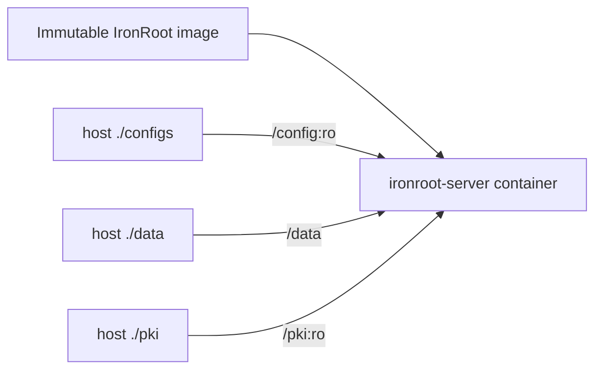

# Podman

Build the image:

```bash
make container-build
```

Run locally:

```bash
podman run --rm -p 8443:8443 \
  -v ./configs:/config:ro \
  -v ./data:/data \
  -v ./pki:/pki:ro \
  localhost/ironroot:dev
```

The container runs as a non-root user and expects config at `/config/config.yaml`, data at `/data`, and CA material at `/pki`.

## Architecture



The image should contain binaries only. Config, database files, TLS certificates, and CA material are mounted from the host.

## Directory Boundaries

| Host path | Container path | Purpose | Recommendation |
| --- | --- | --- | --- |
| `./configs` | `/config` | `config.yaml` | read-only mount |
| `./data` | `/data` | SQLite database | persistent, backed up |
| `./pki` | `/pki` | Root cert, chain, Intermediate cert/key | read-only mount, key `0600` |

The Root CA private key must not be mounted into the container. Only the public Root certificate and Intermediate CA material belong in `/pki`.

## Rootless Podman and SELinux

Prefer rootless Podman. On SELinux hosts, use volume labels when needed:

```bash
podman run --rm -p 8443:8443 \
  -v ./configs:/config:ro,Z \
  -v ./data:/data:Z \
  -v ./pki:/pki:ro,Z \
  localhost/ironroot:dev
```

## Upgrade Workflow

1. Pull or mirror the new image.
2. Stop the old container.
3. Back up `./data` and `./pki`.
4. Start the new container with the same mounts.
5. Verify readiness and run `ironroot-admin security-check`.
