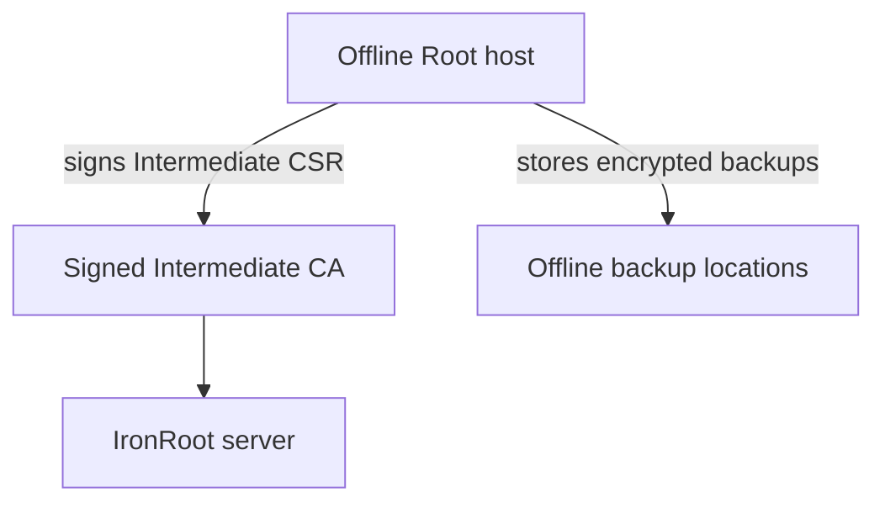

# Offline Root Handling

<div class="ironroot-doc-meta" markdown>
<span class="ironroot-badge ironroot-badge--stage">Stage: Alpha</span>
<span class="ironroot-badge ironroot-badge--status">Status: Draft</span>
</div>

The Root CA is the trust anchor. Treat it as offline infrastructure, not an online service dependency.



Recommended posture:

- create the Root CA on an offline or air-gapped machine
- never copy the Root CA private key to the online IronRoot server
- encrypt the Root CA private key at rest
- keep at least two offline backups in separate secure locations
- use the Root CA only to sign Intermediate CA certificates
- never sign normal server certificates directly with the Root CA
- use an approximate 20 year Root CA lifetime

IronRoot's native command creates the Root CA with these defaults:

```bash
ironroot-admin ca create-root \
  --name "IronRoot Production Root CA" \
  --algorithm ecdsa \
  --curve p384 \
  --validity 20y \
  --max-path-length 1 \
  --encrypt-key \
  --offline \
  --out ./pki/root
```

The generated `root-ca.key` is sensitive. The generated `root-ca.crt` and `trust-bundle/root-ca.crt` are public trust material that can be distributed to systems that must trust IronRoot-issued certificates.

During root migration, serve both old and new roots while issuing from the new Intermediate CA generation. Retire the old root only after old certificates have expired.
